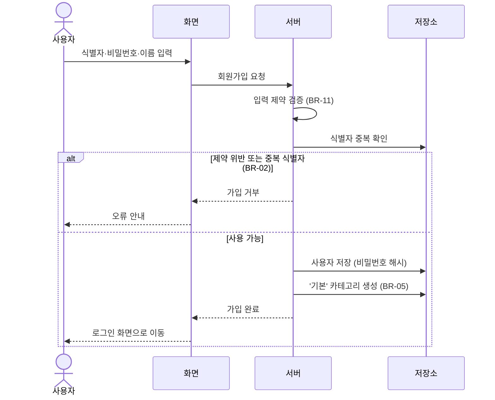
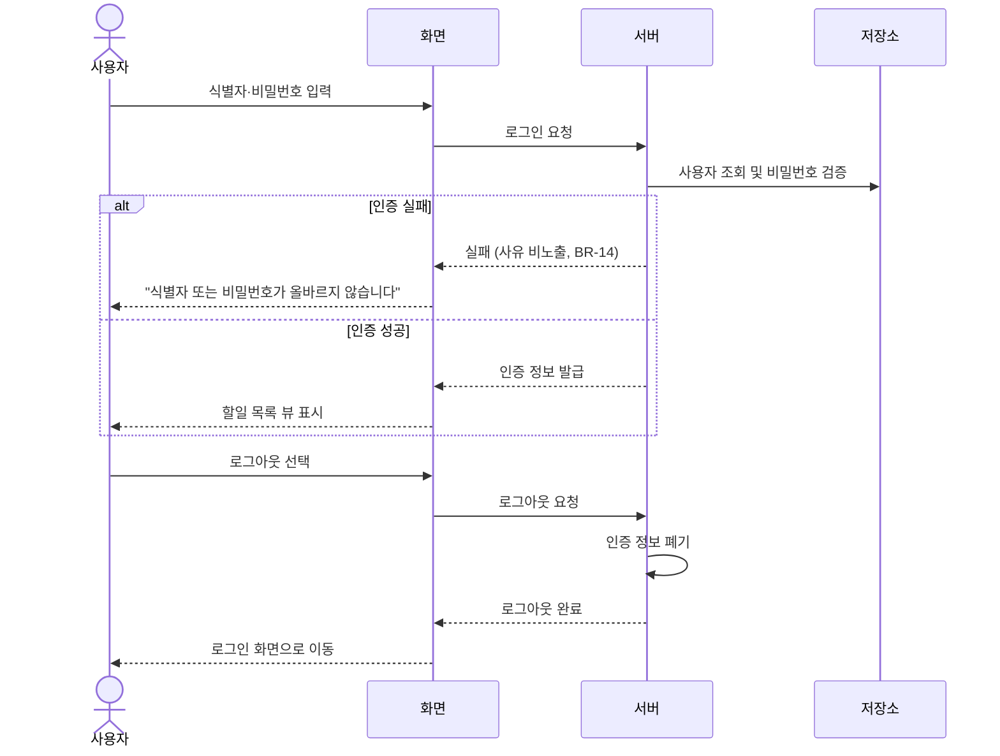
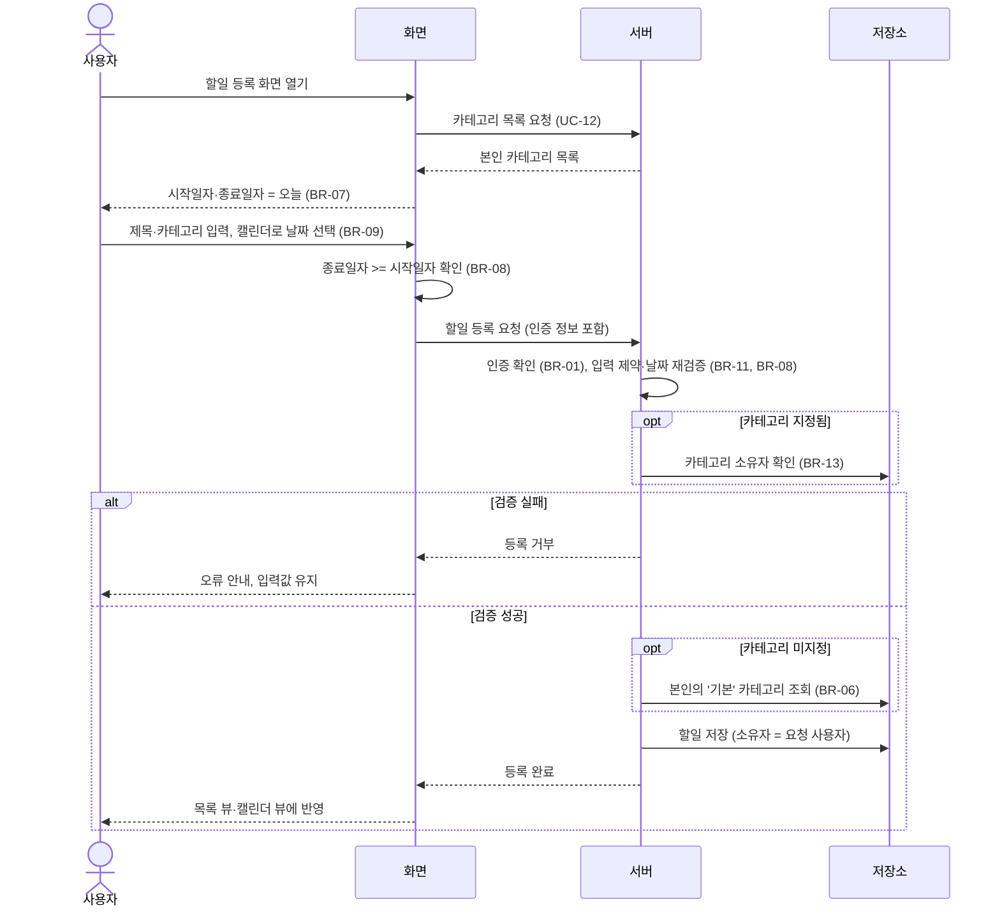
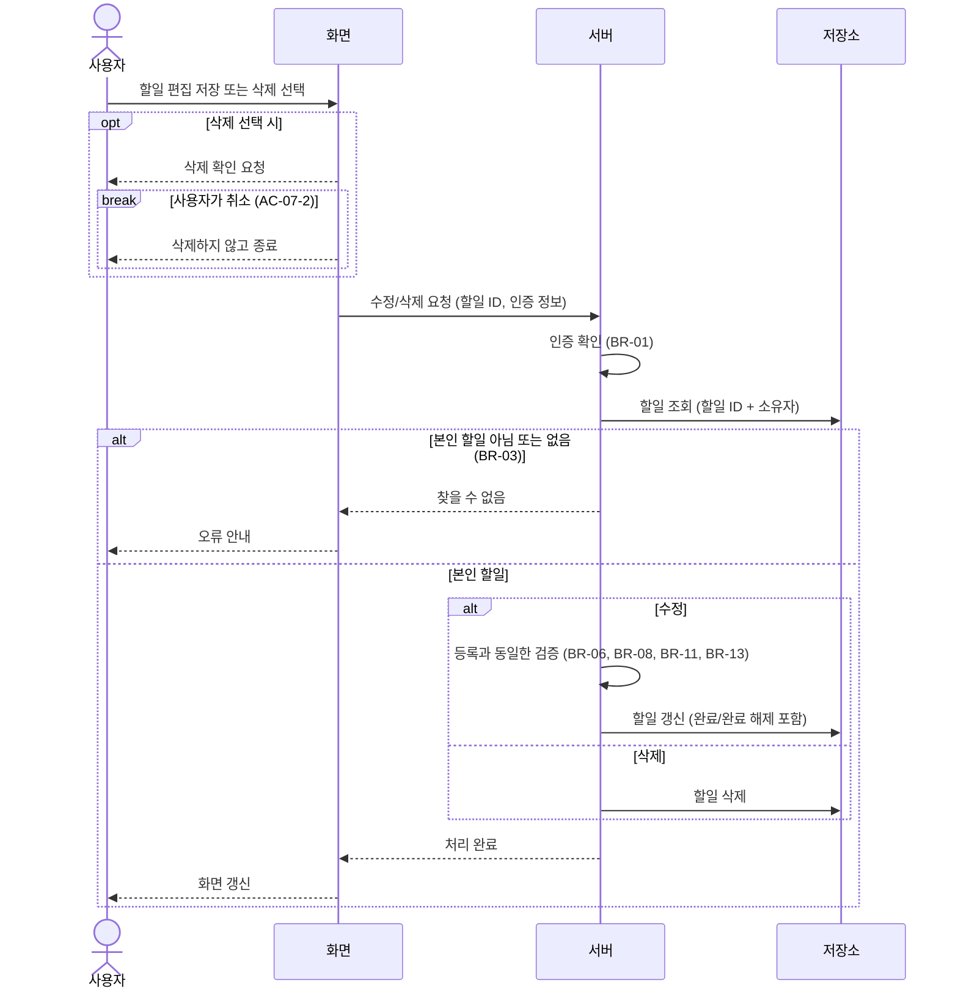
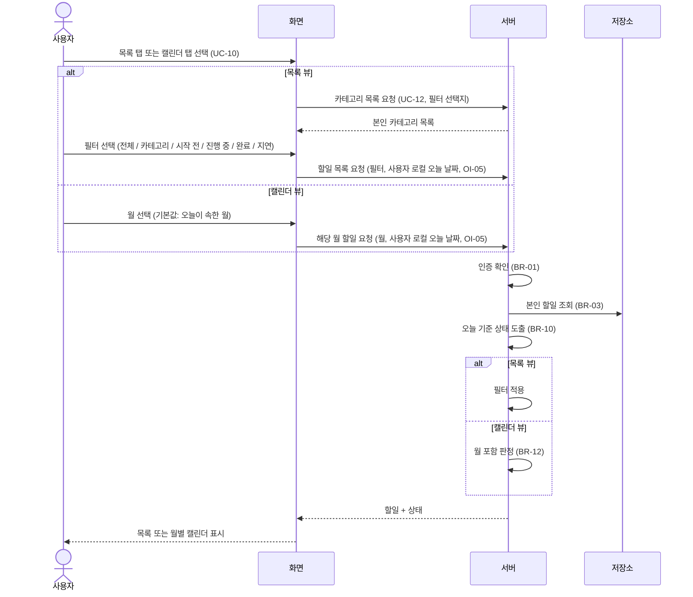

# team-caltalk 도메인 정의서 (초안)

## 문서 변경 이력

> 변경 시 표 맨 아래에 한 줄씩 누적 기록한다. 기존 행은 수정하지 않는다. 삭제된 ID(REQ/BR/UC/AC/OI)는 재사용하지 않는다.

| 버전 | 변경자    | 변경내용                                                                                                                                                                                                                       | 변경일시         |
| ---- | --------- | ------------------------------------------------------------------------------------------------------------------------------------------------------------------------------------------------------------------------------ | ---------------- |
| 0.1  | seungju18 | 도메인 정의서 초안 작성                                                                                                                                                                                                        | 2026-09-30       |
| 0.2  | seungju18 | 범위 축소: 카테고리 이름 변경·삭제 규칙, 다중 필터 조합 제거                                                                                                                                                                   | 2026-09-30       |
| 0.3  | seungju18 | 범위 외 / 미결정 사항(6장) 정리, 시퀀스 다이어그램(7장) 추가                                                                                                                                                                   | 2026-09-30       |
| 0.4  | seungju18 | 문서 변경 이력 추가                                                                                                                                                                                                            | 2026-09-30 10:05 |
| 0.5  | seungju18 | 평가 반영: REQ ID(1.1)·추적 매트릭스(5.3) 추가, UC-05~08 Given/When/Then 수용 기준(5.2), 입력 제약(3장, BR-11), 상태 판정 BR-10, 월 포함 판정 BR-12, UC-11 로그아웃·UC-12 카테고리 목록 조회 추가, '전체' 필터, 날짜 용어 통일 | 2026-09-30 10:14 |
| 0.6  | seungju18 | 재평가 반영: 추적 매트릭스 오매핑 수정·공통 규칙 행 추가·ID 전체 표기, BR-13~16 추가, AC-05-6·AC-09 추가, 7.3~7.5 다이어그램 보정, 중복 서술 정리                                                                              | 2026-09-30 10:21 |
| 0.7  | seungju18 | 카테고리 이름 변경·삭제 범위 포함: REQ-13, BR-17·BR-18, UC-13·UC-14, AC-10 추가, 6.1에서 제거                                                                                                                                  | 2026-09-30 10:54 |
| 0.8  | seungju18 | Google 로그인(기존 계정에 연결) 범위 포함: REQ-14, BR-19 추가, 6.1 수정 | 2026-10-01       |

## 1. 개요 및 문제 정의

team-caltalk는 인증된 사용자가 **자신의 할일을 기간(시작일자~종료일자) 단위로 관리**하고, **목록과 월별 캘린더**로 조회하는 개인 할일 관리 애플리케이션이다.

| 문제                                                                | 해결 방향                                         |
| ------------------------------------------------------------------- | ------------------------------------------------- |
| 인증된 사용자 개인별로 할일을 관리할 수 있는 앱이 없다              | 회원가입/로그인 기반, 사용자별로 격리된 할일 관리 |
| 할일의 시작일자·종료일자를 다루고 캘린더로 조회할 수 있는 앱이 없다 | 할일에 기간을 부여하고 월별 캘린더 뷰 제공        |

### 1.1 원본 요구사항

출처: `prompt/도메인_정의서_생성.md`. 규칙·유스케이스와의 연결은 5.3 추적 매트릭스 참조.

| ID     | 요구사항                                                                                                      |
| ------ | ------------------------------------------------------------------------------------------------------------- |
| REQ-01 | 회원가입 후 로그인(인증)해야 앱을 사용할 수 있다                                                              |
| REQ-02 | 카테고리별로 할일을 등록하며, 카테고리 미지정 시 '기본' 카테고리를 적용한다                                   |
| REQ-03 | 로그인한 사용자는 자신의 정보를 수정할 수 있다                                                                |
| REQ-04 | 할일 등록 시 시작일자·종료일자를 캘린더로 선택·지정할 수 있다                                                 |
| REQ-05 | 종료일자는 시작일자보다 빠를 수 없다                                                                          |
| REQ-06 | 입력화면에서 시작일자는 오늘이 기본값이며 변경할 수 있다                                                      |
| REQ-07 | 입력화면에서 종료일자는 오늘이 기본값이며 변경할 수 있다                                                      |
| REQ-08 | 할일을 목록(List)과 월별 캘린더로 볼 수 있다                                                                  |
| REQ-09 | 목록 화면과 월별 캘린더는 탭으로 전환한다                                                                     |
| REQ-10 | 목록에서 카테고리별 / 시작하지 않은 / 진행중인 / 완료된 / 종료일자가 지났지만 완료되지 않은 할일로 필터링한다 |
| REQ-11 | 인증된 사용자는 할일을 삭제할 수 있다                                                                         |
| REQ-12 | 인증된 사용자는 편집화면으로 할일을 수정할 수 있다                                                            |
| REQ-13 | 카테고리 이름을 수정하고 삭제할 수 있다. 삭제한 카테고리의 할일은 '기본' 카테고리로 변경한다 (v0.7 추가 요구) |
| REQ-14 | 가입된 사용자는 Google 계정으로 로그인할 수 있다. 계정은 회원가입으로만 만들고, 같은 이메일의 계정에 Google 계정을 자동으로 연결한다 (v0.8 추가 요구) |

## 2. 유비쿼터스 언어 (용어집)

> 날짜 용어는 **시작일자 / 종료일자**로만 쓴다 ("시작일", "종료일" 등 약칭 금지).

| 용어                | 정의                                                                     |
| ------------------- | ------------------------------------------------------------------------ |
| 사용자 (User)       | 회원가입 후 로그인(인증)한 앱 이용자. 할일과 카테고리의 소유자           |
| 할일 (Todo)         | 사용자가 수행할 작업 단위. 시작일자·종료일자·카테고리·완료 여부를 가진다 |
| 카테고리 (Category) | 할일을 분류하는 사용자 소유의 묶음                                       |
| 기본 카테고리       | 카테고리를 지정하지 않은 할일에 적용되는 '기본' 카테고리                 |
| 시작일자 / 종료일자 | 할일의 수행 기간. 날짜(일) 단위이며 시각은 다루지 않는다                 |
| 완료                | 사용자가 할일을 끝냈다고 명시적으로 표시한 상태                          |
| 할일 상태           | 시작 전 / 진행 중 / 완료 / 지연 중 하나 (BR-10)                          |
| 시작 전             | 원본의 "시작하지 않은 할일"                                              |
| 진행 중             | 원본의 "진행중인 할일"                                                   |
| 지연                | 원본의 "종료일자가 지났지만 완료되지 않은 할일"                          |
| 오늘                | 사용자 기준 현재 날짜 (OI-05)                                            |
| 목록 뷰 / 캘린더 뷰 | 할일 조회 화면. 탭으로 전환한다                                          |

## 3. 핵심 엔티티

> "제약" 열의 길이는 앞뒤 공백을 제거한 글자 수 기준이다 (비밀번호는 제외, 입력 그대로 센다). 제약 위반 시 BR-11을 따른다.

### 3.1 User (사용자)

| 속성          | 설명                       | 제약                                             |
| ------------- | -------------------------- | ------------------------------------------------ |
| 사용자 ID     | 고유 식별자                | 시스템 생성                                      |
| 로그인 식별자 | 이메일 (OI-01 가정)        | 필수, 이메일 형식, 최대 254자 (BR-02, BR-16)     |
| 비밀번호      | 인증 정보 (평문 저장 금지) | 필수, 8~64자, 영문·숫자 각 1자 이상 (OI-02 가정) |
| 이름          | 표시용 이름                | 필수, 1~30자                                     |
| 가입일시      |                            | 시스템 생성                                      |

### 3.2 Category (카테고리)

| 속성        | 설명                 | 제약                         |
| ----------- | -------------------- | ---------------------------- |
| 카테고리 ID | 고유 식별자          | 시스템 생성                  |
| 소유자      | User                 | 필수                         |
| 이름        | 카테고리 이름        | 필수, 1~20자, 소유자 내 고유 |
| 기본 여부   | '기본' 카테고리 여부 | 사용자당 정확히 1개 (BR-05)  |

### 3.3 Todo (할일)

| 속성          | 설명        | 제약                             |
| ------------- | ----------- | -------------------------------- |
| 할일 ID       | 고유 식별자 | 시스템 생성                      |
| 소유자        | User        | 필수                             |
| 카테고리      | Category    | 필수 (BR-06, BR-13)              |
| 제목          |             | 필수, 1~100자                    |
| 설명          |             | 선택, 최대 1000자                |
| 시작일자      |             | 필수 (BR-07)                     |
| 종료일자      |             | 필수, >= 시작일자 (BR-07, BR-08) |
| 완료 여부     |             | 기본값 미완료                    |
| 생성/수정일시 |             | 시스템 생성                      |

### 3.4 관계

```
User 1 ──< N Category
User 1 ──< N Todo
Category 1 ──< N Todo
```

- Todo와 그 Category는 반드시 같은 User 소유다 (BR-13).

## 4. 비즈니스 규칙

> 공통 규칙: BR-01(인증), BR-03(소유권), BR-11(입력 검증)은 모든 유스케이스에 적용된다. 단, UC-01·UC-02는 인증 전 유스케이스로 BR-01에서 제외한다.

### 4.1 인증

- BR-01: 회원가입 및 로그인(인증)을 해야만 앱 기능을 사용할 수 있다. 인증되지 않은 요청은 거부하고 로그인 화면으로 보낸다.
- BR-02: 로그인 식별자는 시스템 전체에서 고유하다.
- BR-14: 로그인 실패 시 식별자 존재 여부 등 실패 사유를 구분해 알리지 않는다.
- BR-15: 비밀번호를 변경할 때는 현재 비밀번호를 확인한다. 일치하지 않으면 변경을 거부한다.
- BR-16: 로그인 식별자는 가입 후 변경할 수 없다.

### 4.2 소유권 / 권한

- BR-03: 사용자는 **자신의** 할일·카테고리만 조회·등록·수정·삭제할 수 있다. 다른 사용자의 데이터는 존재 여부도 노출하지 않는다 ('찾을 수 없음'으로 응답).
- BR-04: 사용자는 자신의 정보만 수정할 수 있다.
- BR-13: 할일에 지정하는 카테고리는 할일 소유자의 카테고리여야 한다. 아니면 저장을 거부한다.

### 4.3 기본 카테고리

- BR-05: 회원가입 시 사용자별 '기본' 카테고리가 생성된다.
- BR-06: 할일은 항상 하나의 카테고리에 속한다. 할일 등록·수정 시 카테고리가 비어 있으면 '기본' 카테고리를 적용한다.
- BR-17: '기본' 카테고리는 이름을 변경하거나 삭제할 수 없다.
- BR-18: 카테고리를 삭제하면 그 카테고리의 할일은 모두 소유자의 '기본' 카테고리로 옮긴다. 할일은 삭제되지 않는다. 할일 이동과 카테고리 삭제는 함께 성공하거나 함께 실패한다.
- BR-19: Google 로그인은 Google이 확인한 이메일과 같은 로그인 식별자의 계정이 있을 때만 허용한다. 처음 로그인하면 그 계정에 Google 계정을 연결하고, 이후에는 연결된 Google 계정으로만 Google 로그인을 허용한다. 계정이 없으면 회원가입을 안내하고 계정을 만들지 않는다 (v0.8).

### 4.4 날짜 검증

- BR-07: 시작일자와 종료일자는 필수이며, 입력화면에서 둘 다 **오늘**이 기본값이고 변경 가능하다.
- BR-08: **종료일자 >= 시작일자** 여야 한다. 같은 날은 허용(하루짜리 할일), 종료일자가 시작일자보다 빠르면 저장을 거부한다.
- BR-09: 시작일자·종료일자 입력을 선택하면 캘린더가 표시되고, 캘린더에서 고른 날짜가 해당 입력값이 된다. 시각은 입력받지 않는다.

### 4.5 할일 상태 판정

- BR-10: 상태는 저장하지 않고 조회 시점에 오늘(T)을 기준으로 도출한다. 아래 순서대로 **처음 만족하는 조건** 하나로 결정된다 (상호 배타적).

| 순서 | 조건                      | 상태                                  |
| ---- | ------------------------- | ------------------------------------- |
| 1    | 완료 여부 = 완료          | **완료**                              |
| 2    | T < 시작일자              | **시작 전**                           |
| 3    | 시작일자 <= T <= 종료일자 | **진행 중**                           |
| 4    | T > 종료일자              | **지연** (종료일자가 지났지만 미완료) |

- 완료는 날짜와 무관하게 최우선이다 (시작 전에 완료해도 '완료').
- 종료일자 당일은 '진행 중'이며, 다음 날부터 '지연'이다.
- 완료를 해제하면 다시 날짜 기준으로 판정된다.

### 4.6 입력 검증

- BR-11: 3장 "제약" 열이나 BR-08·BR-13을 위반한 입력은 저장을 거부한다. 저장된 데이터는 변경되지 않는다. 위반한 항목과 사유를 안내하고, 화면의 입력값은 그대로 유지한다.

### 4.7 캘린더 월 포함 판정

- BR-12: 할일은 `시작일자 <= 해당 월 말일 AND 종료일자 >= 해당 월 1일`이면 그 월의 캘린더에 표시된다. 여러 달에 걸친 할일은 걸친 모든 달에 표시된다.

## 5. 주요 유스케이스

### 5.1 유스케이스 목록

> "관련 BR" 열에서 공통 규칙(BR-01, BR-03, BR-11)은 생략한다.

| ID    | 유스케이스         | 주요 흐름 / 수용 기준                                                                                     | 관련 REQ                               | 관련 BR                           |
| ----- | ------------------ | --------------------------------------------------------------------------------------------------------- | -------------------------------------- | --------------------------------- |
| UC-01 | 회원가입           | 식별자·비밀번호·이름 입력 → 계정과 '기본' 카테고리 생성. 중복 식별자·제약 위반은 거부                     | REQ-01, REQ-02                         | BR-02, BR-05                      |
| UC-02 | 로그인             | 올바른 인증정보로 로그인 성공 후 목록 뷰 표시. 실패 시 사유 비노출                                        | REQ-01                                 | BR-14                             |
| UC-03 | 내 정보 수정       | 이름, 비밀번호 수정. 로그인 식별자는 변경 불가                                                            | REQ-03                                 | BR-04, BR-15, BR-16               |
| UC-04 | 카테고리 생성      | 이름 입력으로 카테고리 생성. 소유자 내 중복 이름 거부                                                     | REQ-02                                 | -                                 |
| UC-05 | 할일 등록          | 제목·카테고리·시작일자·종료일자 입력 후 저장 (AC-05)                                                      | REQ-02, REQ-04, REQ-05, REQ-06, REQ-07 | BR-06, BR-07, BR-08, BR-09, BR-13 |
| UC-06 | 할일 수정          | 편집화면에서 모든 속성 수정 및 완료/완료 해제 (AC-06)                                                     | REQ-04, REQ-05, REQ-12                 | BR-06, BR-08, BR-09, BR-13        |
| UC-07 | 할일 삭제          | 본인 할일을 확인 후 삭제 (AC-07)                                                                          | REQ-11                                 | -                                 |
| UC-08 | 목록 조회 및 필터  | 필터 단일 선택: 전체(기본값) / 카테고리별 / 시작 전 / 진행 중 / 완료 / 지연 (AC-08)                       | REQ-08, REQ-10                         | BR-10                             |
| UC-09 | 월별 캘린더 조회   | 선택한 월에 포함되는 할일을 시작일자~종료일자 범위에 표시, 월 이동 가능. 기본 월은 오늘이 속한 월 (AC-09) | REQ-08                                 | BR-10, BR-12                      |
| UC-10 | 뷰 전환            | 목록 뷰와 캘린더 뷰를 탭으로 전환                                                                         | REQ-09                                 | -                                 |
| UC-11 | 로그아웃           | 로그아웃 시 인증 정보를 폐기하고 로그인 화면으로 이동. 이후 요청은 BR-01에 따라 거부                      | REQ-01                                 | BR-01                             |
| UC-12 | 카테고리 목록 조회 | 본인 카테고리('기본' 포함)를 조회. 할일 등록·수정의 카테고리 선택지와 UC-08 카테고리 필터 선택지로 사용   | REQ-02, REQ-10                         | -                                 |
| UC-13 | 카테고리 이름 변경 | 새 이름 입력으로 변경. 소유자 내 중복 이름 거부. '기본'은 변경 불가 (AC-10)                               | REQ-13                                 | BR-17                             |
| UC-14 | 카테고리 삭제      | 확인 후 삭제. 소속 할일은 '기본'으로 이동. '기본'은 삭제 불가 (AC-10)                                     | REQ-13                                 | BR-17, BR-18                      |

### 5.2 수용 기준 (Given / When / Then)

> 예시의 오늘(T)은 2026-10-01이다. AC-08, AC-09, AC-10은 아래 예시 데이터를 쓴다 (모두 본인 할일).

| 할일 | 카테고리 | 시작일자   | 종료일자   | 완료 여부 | 상태 (T = 2026-10-01) |
| ---- | -------- | ---------- | ---------- | --------- | --------------------- |
| A    | 업무     | 2026-09-25 | 2026-09-28 | 미완료    | 지연                  |
| B    | 업무     | 2026-09-30 | 2026-10-02 | 미완료    | 진행 중               |
| C    | 기본     | 2026-10-01 | 2026-10-01 | 미완료    | 진행 중               |
| D    | 기본     | 2026-10-05 | 2026-10-06 | 미완료    | 시작 전               |
| E    | 기본     | 2026-10-05 | 2026-10-06 | 완료      | 완료                  |
| F    | 기본     | 2026-09-20 | 2026-09-25 | 완료      | 완료                  |

**AC-05 할일 등록 (UC-05)**

| ID      | Given                                                   | When                     | Then                                               |
| ------- | ------------------------------------------------------- | ------------------------ | -------------------------------------------------- |
| AC-05-1 | 할일 등록 화면을 연다                                   | 날짜를 변경하지 않는다   | 시작일자·종료일자 = 2026-10-01 (BR-07)             |
| AC-05-2 | 제목 "보고서", 카테고리 미선택, 2026-10-01 ~ 2026-10-03 | 저장한다                 | 저장됨. 카테고리 = '기본', 상태 = 진행 중 (BR-06)  |
| AC-05-3 | 시작일자 2026-10-01, 종료일자 2026-10-01                | 저장한다                 | 저장됨 (하루짜리 할일)                             |
| AC-05-4 | 시작일자 2026-10-02, 종료일자 2026-10-01                | 저장한다                 | 저장 거부. 종료일자 오류 안내, 입력값 유지 (BR-08) |
| AC-05-5 | 제목이 공백만 있음                                      | 저장한다                 | 저장 거부. 제목 필수 안내, 입력값 유지 (BR-11)     |
| AC-05-6 | 할일 등록 화면                                          | 시작일자 입력을 선택한다 | 캘린더 표시. 고른 날짜가 시작일자로 입력됨 (BR-09) |

**AC-06 할일 수정 (UC-06)**

| ID      | Given                                                    | When                                      | Then                                                       |
| ------- | -------------------------------------------------------- | ----------------------------------------- | ---------------------------------------------------------- |
| AC-06-1 | 본인 할일, 미완료, 2026-09-27 ~ 2026-09-29 (상태 = 지연) | 완료로 표시하고 저장한다                  | 상태 = 완료. '지연' 결과에서 빠지고 '완료' 결과에 포함     |
| AC-06-2 | 본인 할일, 완료, 2026-10-05 ~ 2026-10-06                 | 완료를 해제하고 저장한다                  | 상태 = 시작 전                                             |
| AC-06-3 | 본인 할일, 2026-10-01 ~ 2026-10-03                       | 종료일자를 2026-09-30으로 바꾸고 저장한다 | 저장 거부. 저장된 값 변경 없음, 입력값 유지 (BR-08, BR-11) |
| AC-06-4 | 다른 사용자의 할일 ID                                    | 수정을 요청한다                           | '찾을 수 없음'. 변경 없음 (BR-03)                          |

**AC-07 할일 삭제 (UC-07)**

| ID      | Given                 | When                     | Then                                  |
| ------- | --------------------- | ------------------------ | ------------------------------------- |
| AC-07-1 | 본인 할일             | 삭제를 선택하고 확인한다 | 삭제됨. 목록 뷰·캘린더 뷰에서 사라짐  |
| AC-07-2 | 본인 할일             | 삭제를 선택하고 취소한다 | 삭제되지 않음. 화면 변화 없음         |
| AC-07-3 | 다른 사용자의 할일 ID | 삭제를 요청한다          | '찾을 수 없음'. 삭제되지 않음 (BR-03) |

**AC-08 목록 조회 및 필터 (UC-08)**

| ID      | Given                                | When                      | Then                        |
| ------- | ------------------------------------ | ------------------------- | --------------------------- |
| AC-08-1 | 예시 데이터                          | 목록 뷰를 연다            | 필터 = 전체, A~F 6건 표시   |
| AC-08-2 | 예시 데이터                          | '지연' 필터 선택          | A                           |
| AC-08-3 | 예시 데이터                          | '진행 중' 필터 선택       | B, C                        |
| AC-08-4 | 예시 데이터                          | '시작 전' 필터 선택       | D                           |
| AC-08-5 | 예시 데이터                          | '완료' 필터 선택          | E, F                        |
| AC-08-6 | 예시 데이터                          | 카테고리 '업무' 필터 선택 | A, B                        |
| AC-08-7 | 예시 데이터, T = 2026-10-02          | '지연' 필터 선택          | A, C (C는 종료일자 다음 날) |
| AC-08-8 | 예시 데이터 + 다른 사용자의 할일 1건 | 목록 뷰를 연다            | A~F 6건만 표시 (BR-03)      |

**AC-09 월별 캘린더 조회 (UC-09)**

| ID      | Given                            | When               | Then                                                  |
| ------- | -------------------------------- | ------------------ | ----------------------------------------------------- |
| AC-09-1 | 예시 데이터                      | 캘린더 뷰를 연다   | 2026-10월 표시. B, C, D, E 표시 (BR-12)               |
| AC-09-2 | 예시 데이터, 2026-10월 캘린더 뷰 | 이전 월로 이동한다 | 2026-09월 표시. A, B, F 표시 (B는 9월·10월 모두 표시) |

**AC-10 카테고리 이름 변경·삭제 (UC-13, UC-14)**

| ID      | Given                               | When                                    | Then                                                           |
| ------- | ----------------------------------- | --------------------------------------- | -------------------------------------------------------------- |
| AC-10-1 | 예시 데이터                         | '업무'를 '회사'로 이름 변경한다         | 변경됨. A, B의 카테고리 = '회사'                               |
| AC-10-2 | 예시 데이터, '개인' 카테고리가 있음 | '업무'를 '개인'으로 이름 변경한다       | 변경 거부. 중복 이름 안내 (3.2 제약)                           |
| AC-10-3 | 예시 데이터                         | '업무'를 삭제하고 확인한다              | '업무' 삭제됨. A, B의 카테고리 = '기본', 할일 6건 유지 (BR-18) |
| AC-10-4 | 예시 데이터                         | '기본'의 이름 변경 또는 삭제를 요청한다 | 거부. '기본'과 할일 변화 없음 (BR-17)                          |

### 5.3 추적 매트릭스

> BR 열은 해당 요구사항을 구체화하는 규칙만 적는다. 공통 규칙(BR-01, BR-03, BR-11)은 "공통" 행에 모은다.

| REQ    | BR                  | UC                         | 수용 기준                                            | 다이어그램    |
| ------ | ------------------- | -------------------------- | ---------------------------------------------------- | ------------- |
| 공통   | BR-01, BR-03, BR-11 | 전체 UC                    | AC-05-5, AC-06-3, AC-06-4, AC-07-3, AC-08-8          | 7.3, 7.4, 7.5 |
| REQ-01 | BR-01, BR-02, BR-14 | UC-01, UC-02, UC-11        | -                                                    | 7.1, 7.2      |
| REQ-02 | BR-05, BR-06, BR-13 | UC-01, UC-04, UC-05, UC-12 | AC-05-2                                              | 7.1, 7.3      |
| REQ-03 | BR-04, BR-15, BR-16 | UC-03                      | -                                                    | -             |
| REQ-04 | BR-09               | UC-05, UC-06               | AC-05-6                                              | 7.3           |
| REQ-05 | BR-08               | UC-05, UC-06               | AC-05-3, AC-05-4, AC-06-3                            | 7.3, 7.4      |
| REQ-06 | BR-07               | UC-05                      | AC-05-1                                              | 7.3           |
| REQ-07 | BR-07               | UC-05                      | AC-05-1                                              | 7.3           |
| REQ-08 | BR-10, BR-12        | UC-08, UC-09               | AC-08-1, AC-09-1, AC-09-2                            | 7.5           |
| REQ-09 | -                   | UC-10                      | -                                                    | 7.5           |
| REQ-10 | BR-10               | UC-08, UC-12               | AC-08-2, AC-08-3, AC-08-4, AC-08-5, AC-08-6, AC-08-7 | 7.5           |
| REQ-11 | -                   | UC-07                      | AC-07-1, AC-07-2                                     | 7.4           |
| REQ-12 | BR-06, BR-08        | UC-06                      | AC-06-1, AC-06-2, AC-06-3                            | 7.4           |
| REQ-13 | BR-17, BR-18        | UC-13, UC-14               | AC-10-1, AC-10-2, AC-10-3, AC-10-4                   | -             |
| REQ-14 | BR-19               | UC-02                      | -                                                    | -             |

## 6. 범위 외 / 미결정 사항

### 6.1 범위 외 (Out of Scope)

| 구분      | 항목                                            |
| --------- | ----------------------------------------------- |
| 협업      | 할일 공유, 팀/협업, 댓글·채팅                   |
| 일정      | 시각(시:분) 단위 일정, 반복 일정, 알림/리마인더 |
| 연동      | 외부 캘린더(구글 등) 연동                       |
| 인증/운영 | Google 외 소셜 로그인, 소셜 계정으로 가입, 비밀번호 찾기, 관리자 기능 |
| 조회      | 주/일 단위 캘린더 뷰, 다중 필터 조합, 검색      |
| 할일 속성 | 우선순위·태그·첨부파일, 하위 할일               |

### 6.2 미결정 사항 (Open Issues)

| ID    | 항목                 | 결정 필요 내용                                                            | 현재 가정 / 결정                                 |
| ----- | -------------------- | ------------------------------------------------------------------------- | ------------------------------------------------ |
| OI-01 | 로그인 식별자        | 이메일 / 아이디 중 무엇을 쓰는가                                          | 가정: 이메일 (3.1 반영)                          |
| OI-02 | 비밀번호 정책        | 최소 길이·조합 규칙                                                       | 가정: 8~64자, 영문·숫자 각 1자 이상 (3.1 반영)   |
| OI-03 | 로그인 유지          | 세션 유지 기간, 자동 로그인 여부                                          | 미정                                             |
| OI-04 | 회원 탈퇴            | 탈퇴 기능 제공 여부 및 데이터 처리                                        | 가정: 제공하지 않음                              |
| OI-05 | '오늘'의 기준 시간대 | 사용자 로컬 시간대 / 서버 시간대                                          | 가정: 사용자 로컬 시간대 (7.5 반영)              |
| OI-06 | 과거 날짜 등록       | 시작일자를 오늘 이전으로 등록 허용 여부                                   | 가정: 허용                                       |
| OI-07 | 기본 카테고리 정책   | 사용자별 생성 vs 시스템 공통, 표시 이름 변경 가능 여부                    | 가정: 사용자별 생성, 이름 변경·삭제 불가 (BR-17) |
| OI-08 | 필터 선택 방식       | 필터 단일 선택 / '전체' 포함 여부                                         | **결정됨**: 단일 선택 + '전체' (UC-08)           |
| OI-09 | 목록 정렬 기준       | 종료일자 / 시작일자 / 등록순                                              | 가정: 종료일자 오름차순                          |
| OI-10 | 캘린더 표시          | 여러 날에 걸친 할일 표시 방식, 완료된 할일 표시 여부, 하루 표시 개수 한도 | 가정: 기간 막대로 표시, 완료도 표시              |
| OI-11 | 삭제 방식            | 즉시 영구 삭제 / 복구 가능                                                | 가정: 확인 후 영구 삭제                          |

## 7. 시퀀스 다이어그램

참여자는 기술 스택과 무관한 논리 단위로 표현한다: **사용자**, **화면(UI)**, **서버**, **저장소**.

### 7.1 회원가입 (UC-01)



### 7.2 로그인·로그아웃 (UC-02, UC-11)



### 7.3 할일 등록 (UC-05)



### 7.4 할일 수정·삭제 (UC-06, UC-07)



### 7.5 목록·캘린더 조회 및 필터 (UC-08 ~ UC-10)


