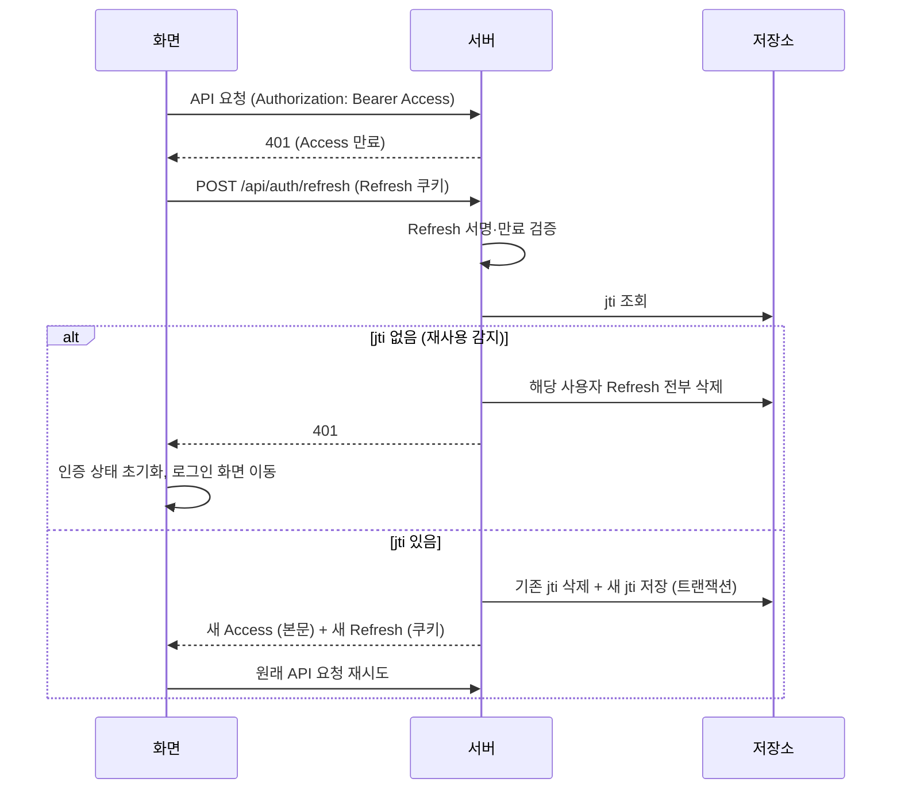

# team-caltalk PRD (초안)

## 문서 변경 이력

> 변경 시 표 맨 아래에 한 줄씩 누적 기록한다. 기존 행은 수정하지 않는다. 삭제된 ID(FR/NFR/KPI/R)는 재사용하지 않는다.

| 버전 | 변경자    | 변경내용                                                                                                                                                                   | 변경일시         |
| ---- | --------- | -------------------------------------------------------------------------------------------------------------------------------------------------------------------------- | ---------------- |
| 0.1  | seungju18 | PRD 초안 작성                                                                                                                                                              | 2026-09-30       |
| 0.2  | seungju18 | 범위 제외 항목을 4.2로 이동(11장 삭제), 카테고리 이름 변경·삭제(FR-16, FR-17) 범위 포함                                                                                    | 2026-09-30 10:54 |
| 0.3  | seungju18 | 7.1 기술 스택에 인증 항목 추가                                                                                                                                             | 2026-09-30 10:57 |
| 0.4  | seungju18 | 인증을 `jsonwebtoken` + `bcrypt`로 변경 (7.1, FR-03, NFR-06, NFR-07, NFR-09, KPI-04, OI-03, R-04, R-07 추가)                                                               | 2026-09-30 10:58 |
| 0.5  | seungju18 | 인증을 JWT Access Token + Refresh Token 방식으로 구체화: 6.4 신설(토큰 사양·회전·재사용 감지·재발급 흐름), FR-03, FR-04, NFR-06, OI-03, 7.2~7.3, 8장, R-07 수정, R-08 추가 | 2026-09-30 11:00 |
| 0.6  | seungju18 | 스타일 Tailwind CSS 추가(7.1), 7.4 프론트엔드 코드 규칙 신설(className 직접 적용, 커스텀 훅 분리), NFR-12 반응형을 Tailwind 접두사로 변경                                  | 2026-09-30 11:08 |
| 0.7  | seungju18 | 프론트엔드 HTTP 클라이언트 axios 추가(7.1), 7.4 직접 호출 금지 대상·`useApiClient` 역할에 axios 반영                                                                       | 2026-09-30       |
| 0.8  | seungju18 | 7.1 프론트엔드 라이브러리 메이저 버전 지정: Zustand 5, TanStack Query 5, axios 1 (React 19 호환 stable, 2026-09-30 npm 기준 5.0.15 / 5.104.0 / 1.20.0)                     | 2026-09-30       |
| 0.9  | seungju18 | 문서 정합성 점검: 7.2 라우팅 사유의 화면 목록에 카테고리 관리(FR-16, FR-17, 와이어프레임 WF-07) 추가                                                                       | 2026-09-30 14:47 |
| 0.10 | seungju18 | 8번 문서 8장 결정 반영: KPI-04 MVP 측정 제외(2.2), 백엔드 TS 실행 방식 추가(7.2), `useCalendarMonth`에 월 할일 조회 역할 추가(7.4)                                         | 2026-09-30 15:06 |

> 기준 문서: `docs/1-domain-definition.md` v0.7 (이하 "도메인 정의서"). 용어, 엔티티, 규칙(BR), 유스케이스(UC), 수용 기준(AC)은 도메인 정의서를 원본으로 하고 이 문서에서는 ID로만 참조한다. `(가정)` 표시는 근거 요구사항 없이 이 PRD에서 정한 값이다.

## 목차

1. 제품 개요
2. 목표와 성공 지표
3. 대상 사용자
4. 범위 (MVP): 4.1 포함 범위, 4.2 범위 제외
5. 기능 요구사항 (FR)
6. 비기능 요구사항 (NFR)
7. 기술 스택 및 구현 방침
8. 일정 (2일 마일스톤)
9. 미결정 사항에 대한 PRD 결정
10. 리스크 및 대응

## 1. 제품 개요

| 항목      | 내용                                                                                          |
| --------- | --------------------------------------------------------------------------------------------- |
| 제품      | 기간(시작일자~종료일자) 단위의 개인 할일을 목록과 월별 캘린더로 관리하는 웹앱                 |
| 해결 문제 | 도메인 정의서 1장 참조 (사용자별 격리된 할일 관리 부재, 기간·캘린더 기반 조회 부재)           |
| 핵심 가치 | 할일의 "상태(시작 전/진행 중/완료/지연)"를 한눈에 확인 (BR-10), 기간을 월 단위로 조망 (BR-12) |
| 플랫폼    | 웹 우선. 모바일은 반응형 웹 UI로만 지원 (네이티브 앱 없음)                                    |

## 2. 목표와 성공 지표

### 2.1 비즈니스 목표

- G-1: 동시 접속 사용자 1,000명이 사용해도 서비스 품질을 유지한다 (NFR-01~03).
- G-2: 2일 내 1인 개발로 핵심 기능(P0)을 완성해 사용 가능한 상태로 만든다 (8장).

### 2.2 KPI

| ID     | 지표                        | 목표                                                         | 측정 방법                                                                                                                |
| ------ | --------------------------- | ------------------------------------------------------------ | ------------------------------------------------------------------------------------------------------------------------ |
| KPI-01 | 수용 기준 통과율            | AC-05 ~ AC-10 전 항목 100% 통과 (Day 2 종료 시점)            | AC 표 기반 수동 테스트 체크리스트                                                                                        |
| KPI-02 | 동시 접속 부하 테스트 결과  | 1,000 VU에서 NFR-01(p95)·NFR-02(에러율) 충족                 | 부하 테스트 리포트 (NFR-03)                                                                                              |
| KPI-03 | 가입 후 첫 할일 등록 전환율 | 가입자 중 가입 당일 할일 1건 이상 등록 비율 70% 이상 (가정)  | DB 집계: users.created_at 당일 todos 존재 여부                                                                           |
| KPI-04 | 주간 재방문율               | 가입 후 7일 내 2일 이상 로그인한 사용자 비율 40% 이상 (가정) | **MVP에서 측정하지 않음.** 로그인 이력을 저장하지 않는다 (8번 문서 8장). 측정이 필요해지면 로그인 이력 테이블을 추가한다 |
| KPI-05 | 할일 완료율                 | 종료일자가 지난 할일 중 완료 비율 50% 이상 (가정)            | DB 집계: 종료일자 < 오늘 인 할일 중 완료 여부 비율                                                                       |

## 3. 대상 사용자

| 세그먼트       | 특징 (PRD 관점)                                                      |
| -------------- | -------------------------------------------------------------------- |
| 학생           | 과제·시험 등 기간이 있는 할일 관리, 모바일 접속 비중 높음 (가정)     |
| 20~50대 직장인 | 업무·개인 할일을 카테고리로 구분, PC 업무 시간 접속 비중 높음 (가정) |

- 페르소나별 상세 시나리오는 작성하지 않는다 (입력 조건).

## 4. 범위 (MVP)

### 4.1 포함 범위

- 우선순위 정의
  - **P0**: 2일 내 반드시 완성. 미완성 시 출시 불가.
  - **P1**: Day 2 잔여 시간에 구현. 원본 요구사항이지만 핵심 흐름(할일 등록·조회)에 영향이 적어 후순위.
  - **P2**: 이번 일정에서 구현하지 않음 (다음 반복).
- 요구사항 REQ-01 ~ REQ-13은 모두 P0 또는 P1로 포함한다. P2는 PRD에서 추가 제안한 항목만 해당한다.
- 기능 목록과 우선순위는 5장 참조.

### 4.2 범위 제외

- 도메인 정의서 6.1 전 항목.
- PRD에서 추가로 제외하는 항목:

| 항목                              | 사유                         |
| --------------------------------- | ---------------------------- |
| 접근성(WCAG, 스크린리더 대응)     | 입력 조건                    |
| 네이티브 모바일 앱, PWA·오프라인  | 반응형 웹만 지원 (입력 조건) |
| 다국어(i18n), 다크 모드           | 2일 일정 (가정)              |
| 회원 탈퇴                         | OI-04                        |
| 캘린더 연속 막대 렌더링, FR-15    | P2 (OI-10)                   |
| 운영 모니터링·알림 시스템, 이중화 | 1인 예산 (가정)              |

## 5. 기능 요구사항 (FR)

> 모든 FR에 공통 규칙 BR-01, BR-03, BR-11이 적용된다 (도메인 정의서 4장 공통 규칙). 수용 기준은 도메인 정의서 5.2를 그대로 쓴다.

| ID    | 기능                    | 설명 (제품 관점)                                                                                       | 관련 UC | 관련 REQ                               | 수용 기준 / 규칙                  | 우선순위 |
| ----- | ----------------------- | ------------------------------------------------------------------------------------------------------ | ------- | -------------------------------------- | --------------------------------- | -------- |
| FR-01 | 회원가입                | 이메일·비밀번호·이름으로 가입, 가입 시 '기본' 카테고리 자동 생성                                       | UC-01   | REQ-01, REQ-02                         | BR-02, BR-05, 3.1 제약            | P0       |
| FR-02 | 로그인                  | 성공 시 목록 뷰로 진입, 실패 사유 비노출                                                               | UC-02   | REQ-01                                 | BR-14                             | P0       |
| FR-03 | 로그아웃                | Refresh Token 폐기(DB 삭제)·쿠키 삭제, Access Token 폐기 후 로그인 화면 이동 (6.4)                     | UC-11   | REQ-01                                 | BR-01                             | P0       |
| FR-04 | 인증 가드               | 미인증 상태의 화면 접근·API 요청 차단. Access 만료 시 Refresh로 자동 재발급, 실패 시 로그인 화면 (6.4) | 전체 UC | REQ-01                                 | BR-01                             | P0       |
| FR-05 | 카테고리 목록 조회      | 할일 입력의 카테고리 선택지, 목록 필터 선택지로 사용                                                   | UC-12   | REQ-02, REQ-10                         | BR-03                             | P0       |
| FR-06 | 카테고리 생성           | 이름 입력으로 생성, 소유자 내 중복 거부                                                                | UC-04   | REQ-02                                 | 3.2 제약                          | P0       |
| FR-07 | 할일 등록               | 제목·설명·카테고리·시작일자·종료일자 입력. 날짜 기본값 오늘, 캘린더로 선택                             | UC-05   | REQ-02, REQ-04, REQ-05, REQ-06, REQ-07 | AC-05, BR-06~09, BR-13            | P0       |
| FR-08 | 할일 수정 / 완료 토글   | 편집화면에서 전 속성 수정 및 완료/완료 해제                                                            | UC-06   | REQ-04, REQ-05, REQ-12                 | AC-06, BR-06, BR-08, BR-09, BR-13 | P0       |
| FR-09 | 할일 삭제               | 확인 대화상자 후 영구 삭제                                                                             | UC-07   | REQ-11                                 | AC-07                             | P0       |
| FR-10 | 목록 뷰 및 필터         | 단일 선택 필터(전체/카테고리/시작 전/진행 중/완료/지연), 종료일자 오름차순 정렬                        | UC-08   | REQ-08, REQ-10                         | AC-08, BR-10                      | P0       |
| FR-11 | 월별 캘린더 뷰          | 오늘이 속한 월 기본 표시, 이전/다음 월 이동, 월에 걸친 할일 표시                                       | UC-09   | REQ-08                                 | AC-09, BR-10, BR-12               | P0       |
| FR-12 | 뷰 탭 전환              | 목록/캘린더 탭 전환. 탭 전환 시 등록·수정 결과가 즉시 반영                                             | UC-10   | REQ-09                                 | -                                 | P0       |
| FR-13 | 내 정보 수정            | 이름 변경, 현재 비밀번호 확인 후 비밀번호 변경. 이메일 변경 불가                                       | UC-03   | REQ-03                                 | BR-04, BR-15, BR-16               | P1       |
| FR-14 | 목록 행에서 완료 토글   | 편집화면 진입 없이 목록에서 체크박스로 완료/완료 해제 (FR-08의 단축 동작) (가정)                       | UC-06   | REQ-12                                 | AC-06-1, AC-06-2                  | P1       |
| FR-15 | 캘린더 날짜 셀에서 등록 | 캘린더 날짜 셀 클릭 시 해당 날짜를 시작일자·종료일자로 채운 등록 화면 열기 (가정)                      | UC-05   | REQ-04                                 | AC-05 (기본값만 해당 날짜로 대체) | P2       |
| FR-16 | 카테고리 이름 변경      | 새 이름으로 변경, 소유자 내 중복 거부. '기본'은 변경 불가                                              | UC-13   | REQ-13                                 | AC-10-1, AC-10-2, AC-10-4, BR-17  | P0       |
| FR-17 | 카테고리 삭제           | 확인 후 삭제. 소속 할일은 모두 '기본' 카테고리로 이동하고 할일은 삭제하지 않음. '기본'은 삭제 불가     | UC-14   | REQ-13                                 | AC-10-3, AC-10-4, BR-17, BR-18    | P0       |

### 5.1 FR 보충 결정

- FR-07/FR-08 날짜 선택(BR-09)은 브라우저 기본 날짜 입력(`<input type="date">`)의 캘린더로 충족한다. 별도 date picker 라이브러리를 쓰지 않는다.
- FR-07/FR-08의 BR-08·BR-11 검증은 화면과 서버 양쪽에서 수행하되, 서버 검증을 기준으로 한다 (화면 검증은 UX 보조).
- FR-10/FR-11의 상태 판정(BR-10)은 서버가 요청에 포함된 사용자 로컬 '오늘' 날짜로 계산해 응답에 포함한다 (9장 OI-05).
- FR-11 캘린더 표시 방식: 9장 OI-10 결정 참조.

## 6. 비기능 요구사항 (NFR)

### 6.1 성능 / 용량

| ID     | 항목             | 목표                                                                                                                                                                                                      |
| ------ | ---------------- | --------------------------------------------------------------------------------------------------------------------------------------------------------------------------------------------------------- |
| NFR-01 | 응답시간         | 1,000 VU 부하에서 API p95: 조회(목록·캘린더·카테고리) 300ms 이하, 쓰기(등록·수정·삭제) 500ms 이하, 로그인 800ms 이하 (가정: 비밀번호 해시 비용 반영)                                                      |
| NFR-02 | 에러율           | 1,000 VU 부하에서 HTTP 5xx + 타임아웃 비율 1% 미만                                                                                                                                                        |
| NFR-03 | 부하 테스트      | 시나리오: 로그인 → 목록 조회(필터 1회) → 캘린더 조회(월 이동 1회) → 할일 등록 → 수정 → 삭제, 사고 시간 1~3초 (가정). 1,000 VU까지 2분 램프업 후 5분 유지. 사전 데이터: 사용자 1,000명 × 할일 100건 (가정) |
| NFR-04 | 데이터 조회 범위 | 목록·캘린더 조회는 본인 데이터만 DB 쿼리 단계에서 필터링 (전체 조회 후 앱 필터링 금지). 사용자 ID 기준 인덱스 필수                                                                                        |
| NFR-05 | DB 커넥션        | pg 커넥션 풀 사용, 최대 커넥션 20 (가정). 요청당 커넥션 점유는 쿼리 실행 동안만                                                                                                                           |

### 6.2 보안

| ID     | 항목             | 요구사항                                                                                                                                                                                             |
| ------ | ---------------- | ---------------------------------------------------------------------------------------------------------------------------------------------------------------------------------------------------- |
| NFR-06 | 인증 방식        | JWT(`jsonwebtoken`) 기반 **Access Token + Refresh Token** 방식. 토큰 사양·흐름은 6.4를 따른다                                                                                                        |
| NFR-07 | 비밀번호 저장    | 평문 저장 금지. `bcrypt` 해시 저장, cost factor 10 (가정). bcrypt는 72바이트까지만 반영하므로 비밀번호 최대 64자(도메인 정의서 3.1)는 72바이트 이내여야 한다 (가정: 영문·숫자·ASCII 특수문자만 허용) |
| NFR-08 | SQL 인젝션 방지  | 모든 쿼리는 pg 파라미터 바인딩(`$1, $2 ...`)만 사용. 사용자 입력을 SQL 문자열에 연결 금지. 정렬·필터 값은 서버의 허용 목록에서 매핑                                                                  |
| NFR-09 | 소유권 강제      | 할일·카테고리 조회/수정/삭제 쿼리에 항상 `소유자 = Access Token의 사용자 ID(sub)` 조건 포함. 불일치 시 404 (BR-03, BR-13)                                                                            |
| NFR-10 | 입력 검증        | 서버에서 도메인 정의서 3장 제약 전 항목 검증 후 400 응답 + 항목별 사유 (BR-11). 요청 본문 크기 제한 100KB (가정)                                                                                     |
| NFR-11 | 로그인 남용 방지 | 동일 IP 로그인 실패 분당 10회 초과 시 일시 거부 (가정, P1). 메모리 카운터로 단순 구현                                                                                                                |

### 6.3 UI / 호환성

| ID     | 항목                  | 요구사항                                                                                                                                                                       |
| ------ | --------------------- | ------------------------------------------------------------------------------------------------------------------------------------------------------------------------------ |
| NFR-12 | 반응형 브레이크포인트 | 모바일 < 768px, 태블릿 768~1023px, 데스크톱 ≥ 1024px (가정). Tailwind 기본 브레이크포인트 `md:`(768px)·`lg:`(1024px) 접두사로만 구현, 모바일 우선(접두사 없는 클래스 = 모바일) |
| NFR-13 | 모바일 캘린더         | 768px 미만에서는 캘린더 셀에 할일 개수만 표시, 상세는 목록 뷰에서 확인 (가정)                                                                                                  |
| NFR-14 | 지원 브라우저         | 최신 Chrome, Edge, Safari, Firefox (각 최신 2개 버전) (가정)                                                                                                                   |
| NFR-15 | 접근성                | **범위 외** (입력 조건). WCAG 등 접근성 기준은 적용하지 않는다                                                                                                                 |

### 6.4 인증 토큰 (NFR-06 상세)

**토큰 사양**

| 항목            | Access Token                                                                                        | Refresh Token                                                                              |
| --------------- | --------------------------------------------------------------------------------------------------- | ------------------------------------------------------------------------------------------ |
| 형식            | JWT, `HS256`                                                                                        | JWT, `HS256`                                                                               |
| 서명 키         | 환경 변수 `JWT_ACCESS_SECRET`                                                                       | 환경 변수 `JWT_REFRESH_SECRET` (Access와 다른 키)                                          |
| payload         | `sub`(사용자 ID), `type: "access"`                                                                  | `sub`(사용자 ID), `jti`(UUID), `type: "refresh"`                                           |
| 만료            | 15분 (가정)                                                                                         | 7일 (가정)                                                                                 |
| 클라이언트 보관 | 로그인·재발급 응답 본문으로 받아 **Zustand 메모리**에만 보관. localStorage·sessionStorage 저장 금지 | `HttpOnly; SameSite=Strict; Path=/api/auth` 쿠키 (운영 환경 `Secure`). JS에서 읽을 수 없음 |
| 전송            | `Authorization: Bearer <token>` 헤더                                                                | 쿠키로 자동 전송 (`/api/auth/refresh`, `/api/auth/logout`에만)                             |
| 서버 저장       | 없음                                                                                                | `refresh_tokens` 테이블에 `jti`, 사용자 ID, 만료일시 저장 (토큰 원문은 저장하지 않음)      |
| 무효화          | 불가. 만료(최대 15분)까지 유효 (R-07)                                                               | DB 행 삭제로 즉시 무효화                                                                   |

**처리 규칙**

- **로그인 (FR-02):** 비밀번호 검증 후 Access·Refresh 발급, Refresh의 `jti`를 DB에 저장. 같은 사용자의 만료된 Refresh 행은 이때 삭제한다.
- **API 요청:** 서버는 Access를 검증한다. 알고리즘 `HS256` 고정, `type = "access"` 확인. 없거나 만료·위조면 401.
- **재발급 (`POST /api/auth/refresh`):** Refresh 서명·만료·`type` 검증 → DB에 `jti`가 있는지 확인 → 기존 행 삭제 + 새 Refresh 발급·저장(**회전**) + 새 Access 발급. 삭제와 저장은 하나의 트랜잭션.
- **재사용 감지:** 서명은 유효한데 DB에 `jti`가 없으면(이미 회전된 토큰) 탈취로 보고 해당 사용자의 Refresh 행을 모두 삭제하고 401.
- **로그아웃 (FR-03):** 해당 `jti` 행 삭제, Refresh 쿠키 삭제, 클라이언트는 메모리의 Access 폐기.
- **비밀번호 변경 (FR-13):** 해당 사용자의 Refresh 행을 모두 삭제해 다른 기기도 로그아웃시킨다. 현재 기기에는 새 토큰을 발급한다.
- **클라이언트 (FR-04):**
  - API가 401을 반환하면 재발급을 1회 호출하고, 성공하면 원래 요청을 재시도한다.
  - 동시에 여러 요청이 401이면 재발급 요청 1개를 공유한다 (재사용 감지 오탐 방지).
  - 재발급이 실패하면 Zustand 인증 상태와 TanStack Query 캐시를 비우고 로그인 화면으로 이동한다.
  - 새로고침·재방문 시 메모리에 Access가 없으므로 앱 시작 시 재발급을 호출해 로그인 상태를 복구한다.
- **CSRF:** Access는 헤더로만 전송되어 CSRF 대상이 아니다. Refresh 쿠키는 `SameSite=Strict`와 `Path` 제한으로 보호한다.

**재발급 흐름**

## 7. 기술 스택 및 구현 방침

### 7.1 지정 스택

| 계층       | 기술                                                                                                   |
| ---------- | ------------------------------------------------------------------------------------------------------ |
| 프론트엔드 | React 19, TypeScript, Zustand 5, TanStack Query 5 (`@tanstack/react-query`), axios 1 (HTTP 클라이언트) |
| 백엔드     | Node.js, TypeScript, Express, pg                                                                       |
| DB         | PostgreSQL 17                                                                                          |
| 스타일     | Tailwind CSS (v4, Vite 플러그인 `@tailwindcss/vite`). **className 직접 적용 방식만 사용** (7.4)        |
| 인증       | `jsonwebtoken` (JWT Access Token·Refresh Token 발급·검증, 6.4), `bcrypt` (비밀번호 해시, NFR-07)       |
| 금지       | Prisma (및 ORM 전반, 가정)                                                                             |

- 상태 관리 역할 분리: 서버 데이터(할일·카테고리·사용자)는 TanStack Query, UI 상태(현재 탭, 필터, 캘린더 월, 로그인 여부)는 Zustand.
- 등록·수정·삭제 성공 시 TanStack Query 캐시 무효화로 목록·캘린더 뷰 동시 반영 (FR-12, AC-07-1).

### 7.2 가정 / 제안 (지정 스택 외, 최소화)

| 항목             | 제안                                                                                                                                      | 사유                                                                                     |
| ---------------- | ----------------------------------------------------------------------------------------------------------------------------------------- | ---------------------------------------------------------------------------------------- |
| 빌드 도구        | Vite (제안)                                                                                                                               | React 19 + TS 프로젝트 생성·개발 서버. 사실상 필수                                       |
| 백엔드 TS 실행   | 빌드 없이 Node.js 내장 타입 제거로 실행 (`node src/server.ts`, 개발은 `node --watch`). 타입 검사는 `tsc --noEmit`. Node.js 24 이상 (가정) | 추가 의존성(`tsx`, `ts-node` 등) 없음. `enum` 등 타입 제거가 불가능한 문법은 쓰지 않는다 |
| 부하 테스트 도구 | k6 (제안)                                                                                                                                 | NFR-03 실행용. 앱 의존성 아님                                                            |
| 쿠키 파싱        | `cookie-parser` (제안)                                                                                                                    | Refresh Token 쿠키 읽기 (6.4)                                                            |
| 라우팅           | 사용하지 않음 (가정)                                                                                                                      | 화면이 로그인/가입/메인(탭)/카테고리 관리/내 정보 뿐이라 Zustand 상태로 전환             |
| 날짜·캘린더 UI   | 라이브러리 사용하지 않음 (가정)                                                                                                           | `<input type="date">` + Tailwind `grid grid-cols-7` 월 달력으로 충분                     |
| 입력 검증        | 라이브러리 사용하지 않음 (가정)                                                                                                           | 제약 항목이 적어 수동 검증 함수로 충분                                                   |
| 배포             | 단일 서버에서 Express가 프론트 빌드 정적 파일 동시 서빙 (가정)                                                                            | 같은 출처로 CORS·쿠키 설정 불필요, 1인 예산                                              |

### 7.3 구현 유의사항

- 날짜는 PostgreSQL `DATE` 타입, API에서는 `YYYY-MM-DD` 문자열로만 주고받는다. pg는 `DATE`를 JS `Date`로 변환해 시간대 오차가 생기므로 타입 파서(OID 1082)를 문자열 반환으로 설정한다.
- 상태 판정(BR-10), 월 포함 판정(BR-12), 필터는 SQL(`CASE`, `WHERE`)로 처리해 NFR-04를 충족한다.
- 스키마 무결성은 DB 제약으로 강제: 이메일 UNIQUE(BR-02), (소유자, 카테고리 이름) UNIQUE, `CHECK (종료일자 >= 시작일자)`(BR-08), 사용자당 기본 카테고리 1개 부분 UNIQUE 인덱스(BR-05).
- 회원가입의 사용자 생성 + '기본' 카테고리 생성은 하나의 트랜잭션으로 처리한다 (BR-05).
- 카테고리 삭제는 하나의 트랜잭션으로 처리한다: 소속 할일의 카테고리를 '기본'으로 `UPDATE` → 카테고리 `DELETE` (BR-18). 할일→카테고리 FK는 `ON DELETE RESTRICT`로 두어 할일이 함께 삭제되는 것을 막는다. '기본' 카테고리 변경·삭제 요청은 서버에서 거부한다 (BR-17).
- `refresh_tokens` 테이블: `jti`(PK), 사용자 ID(FK, `ON DELETE CASCADE`, 인덱스), 만료일시 (6.4).

### 7.4 프론트엔드 코드 규칙 (필수)

**스타일: Tailwind CSS className 직접 적용**

- 모든 스타일은 JSX 태그의 `className`에 Tailwind 유틸리티 클래스를 **직접** 작성한다.
  - 예: `<button className="rounded-md bg-blue-600 px-4 py-2 text-white hover:bg-blue-700">`
- **금지:**
  - 컴포넌트별 CSS 파일 작성·import (`import './Button.css'` 등)
  - CSS Modules (`*.module.css`), CSS-in-JS (styled-components, emotion 등)
  - `style={{ ... }}` 인라인 스타일 객체. 단, 캘린더 막대 위치처럼 런타임 계산 값이 필요한 경우만 예외
  - `@apply`로 커스텀 클래스 만들기
- **유일한 CSS 파일:** 앱 진입점의 `src/index.css` 1개. 내용은 `@import "tailwindcss";`와 필요 시 `@theme` 설정만. `main.tsx`에서만 import한다.
- 반복되는 클래스 묶음은 CSS로 빼지 않고 **작은 컴포넌트로 추출**한다 (예: `Button`, `Input`, `Badge`).
- 조건부 클래스는 템플릿 리터럴로 조합한다. 추가 라이브러리(`clsx` 등)는 쓰지 않는다 (가정).
- 반응형은 `md:`, `lg:` 접두사로 처리한다 (NFR-12).

**컴포넌트는 짧게, 로직은 커스텀 훅으로**

- 컴포넌트는 **렌더링(JSX)만** 담당한다. 아래 로직은 모두 커스텀 훅(`use*`)으로 분리한다.
  - 서버 통신: TanStack Query `useQuery` / `useMutation` 호출과 캐시 무효화
  - 폼 상태, 입력 검증, 제출 처리
  - Zustand store 구독·액션 호출
  - 날짜 계산, 필터링, 캘린더 그리드 생성 같은 파생 데이터
  - 이벤트 핸들러가 2줄을 넘는 경우
- 컴포넌트 파일은 **100줄 이하**를 목표로 한다 (가정). 넘으면 하위 컴포넌트나 훅으로 나눈다.
- 컴포넌트 안에서 `useQuery`, `useMutation`, axios(`fetch` 포함)를 직접 호출하지 않는다. 반드시 훅을 거친다.
- 훅 예시 (가정):

| 훅                 | 역할                                                                 | 관련              |
| ------------------ | -------------------------------------------------------------------- | ----------------- |
| `useAuth`          | 로그인·로그아웃·회원가입 mutation, 인증 상태                         | FR-01~03          |
| `useApiClient`     | axios 인터셉터로 Access Token 헤더 첨부, 401 시 재발급 1회 후 재시도 | FR-04, 6.4        |
| `useCategories`    | 카테고리 목록 조회, 생성·이름 변경·삭제 mutation                     | FR-05, 06, 16, 17 |
| `useTodos`         | 필터별 할일 목록 조회                                                | FR-10             |
| `useTodoMutations` | 할일 등록·수정·삭제, 성공 시 목록·캘린더 캐시 무효화                 | FR-07~09          |
| `useTodoForm`      | 폼 상태, 날짜 기본값 오늘, BR-08·BR-11 화면 검증                     | FR-07, FR-08      |
| `useCalendarMonth` | 현재 월 상태, 월 이동, 월 할일 조회, 월 그리드(날짜 × 할일) 생성     | FR-11             |
| `useProfile`       | 내 정보 수정, 비밀번호 변경                                          | FR-13             |

## 8. 일정 (2일 마일스톤)

> 1인 개발, 1일 8~10시간 기준 (가정).

| 일정       | 작업                                                                                                                                        | 산출물                                    | 완료 기준                                                                                 |
| ---------- | ------------------------------------------------------------------------------------------------------------------------------------------- | ----------------------------------------- | ----------------------------------------------------------------------------------------- |
| Day 1 오전 | 프로젝트 셋업(프론트/백), DB 스키마·인덱스·제약 작성, pg 풀·DATE 파서 설정                                                                  | 실행 가능한 FE/BE 골격, 스키마 SQL 파일   | 스키마 적용 성공, 헬스체크 API 응답                                                       |
| Day 1 오후 | 인증 API(FR-01~04, 토큰 발급·재발급·회전 포함), 카테고리 API(FR-05, FR-06, FR-16, FR-17), 할일 CRUD·목록·월 조회 API(FR-07~11 서버 측)      | REST API 전체, 수동 테스트용 요청 모음    | AC-05~AC-09의 서버 측 판정(저장 거부, 404, 필터 결과, 월 포함 결과)이 API 응답으로 확인됨 |
| Day 2 오전 | 화면: 로그인/가입(401 재발급 처리 포함), 목록 뷰+필터, 할일 등록/편집/삭제, 캘린더 뷰, 탭 전환, 카테고리 관리 (FR-01~12, FR-16, FR-17 화면) | 동작하는 웹앱 (데스크톱)                  | KPI-01: AC-05~AC-10 전 항목 화면에서 통과                                                 |
| Day 2 오후 | 반응형(NFR-12, NFR-13), P1(FR-13, FR-14, NFR-11), 부하 테스트(NFR-03) 및 병목 1차 조치, 배포                                                | 반응형 UI, 부하 테스트 리포트, 배포된 URL | 375px/768px/1280px 화면 확인, KPI-02 충족 또는 미달 원인·조치 계획 기록                   |

- 일정 초과 시 절단 순서: FR-15(P2) → NFR-11 → FR-14 → FR-13 → NFR-13. P0는 절단하지 않는다.

## 9. 미결정 사항에 대한 PRD 결정

> 도메인 정의서 6.2 중 범위·일정에 영향 있는 항목만 다룬다. OI-01, OI-02, OI-07, OI-08은 도메인 정의서의 가정/결정을 그대로 따른다.

| OI    | PRD 결정 / 가정                                                                                                   | 영향                           |
| ----- | ----------------------------------------------------------------------------------------------------------------- | ------------------------------ |
| OI-03 | Access 15분, Refresh 7일(재발급마다 회전). Refresh가 유효한 동안 로그인 유지, 별도 "자동 로그인" 옵션 없음 (가정) | NFR-06 구현 범위 최소화        |
| OI-04 | 회원 탈퇴 미제공 (도메인 가정 유지)                                                                               | FR 없음                        |
| OI-05 | 화면이 사용자 로컬 '오늘'(`YYYY-MM-DD`)을 조회 요청에 포함, 서버는 형식만 검증하고 사용 (가정)                    | FR-10, FR-11, 서버 시간대 무관 |
| OI-06 | 과거 날짜 등록 허용 (도메인 가정 유지)                                                                            | 검증 로직 단순화               |
| OI-09 | 종료일자 오름차순, 동일 시 등록순 (가정: 동일 시 규칙 추가)                                                       | FR-10                          |
| OI-10 | 데스크톱: 걸친 각 날짜 셀에 제목 표시(연속 막대 렌더링은 P2), 완료는 취소선으로 표시, 셀당 3건 + "+N" (가정)      | FR-11 구현 난이도 축소         |
| OI-11 | 확인 후 영구 삭제 (도메인 가정 유지)                                                                              | FR-09                          |

## 10. 리스크 및 대응

| ID   | 리스크                                                  | 영향 | 대응                                                                                                                         |
| ---- | ------------------------------------------------------- | ---- | ---------------------------------------------------------------------------------------------------------------------------- |
| R-01 | 2일 일정 초과                                           | 높음 | P0 우선 완료, 8장 절단 순서 적용. 라이브러리·추상화 최소화(7.2)                                                              |
| R-02 | 1인 개발로 리뷰·테스트 부재                             | 중간 | AC 표를 테스트 체크리스트로 사용(KPI-01), DB 제약(7.3)으로 규칙 이중 보호                                                    |
| R-03 | 1,000 동시 접속 시 응답 지연                            | 높음 | 인덱스(사용자 ID+날짜), 커넥션 풀, 필요 시 Node cluster로 CPU 코어 수만큼 프로세스 확장 (가정)                               |
| R-04 | 로그인 해시 연산(bcrypt)이 부하 시 CPU 병목             | 중간 | 비동기 API(`bcrypt.hash`/`compare`)만 사용, 로그인은 부하 시나리오에서 VU당 1회로 제한, 필요 시 cost 조정 또는 프로세스 확장 |
| R-05 | 날짜 시간대 오차로 상태·월 판정 오류                    | 중간 | DATE 문자열 처리(7.3), '오늘'은 클라이언트 전달(OI-05), AC-08-7·AC-09로 검증                                                 |
| R-06 | 부하 테스트 환경 부족(1인 예산)                         | 낮음 | 로컬 또는 단일 VM에서 k6 실행, 결과에 환경 사양을 함께 기록                                                                  |
| R-07 | Access Token은 로그아웃 후에도 만료(최대 15분)까지 유효 | 낮음 | 만료를 15분으로 짧게 유지, 메모리 보관으로 탈취 가능성 축소. Refresh는 DB 삭제로 즉시 무효화 (6.4)                           |
| R-08 | Access Token 메모리 보관 시 XSS로 탈취 가능             | 중간 | React 기본 이스케이프 유지, `dangerouslySetInnerHTML` 사용 금지. Refresh는 `HttpOnly`라 JS 접근 불가                         |
