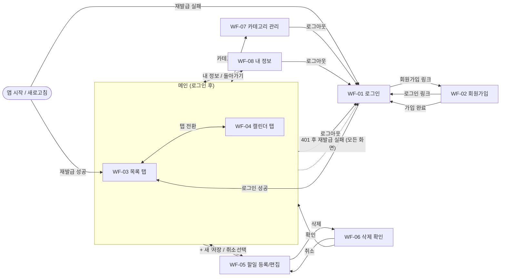

# team-caltalk 와이어프레임 (초안)

## 문서 변경 이력

> 변경 시 표 맨 아래에 한 줄씩 누적 기록한다. 기존 행은 수정하지 않는다. 삭제된 ID(WF)는 재사용하지 않는다.

| 버전 | 변경자    | 변경내용                                                                                            | 변경일시         |
| ---- | --------- | --------------------------------------------------------------------------------------------------- | ---------------- |
| 0.1  | seungju18 | 와이어프레임 초안 작성                                                                              | 2026-09-30       |
| 0.2  | seungju18 | 문서 정합성 점검: 기준 PRD v0.9·시나리오 v0.3, WF-07 결정 문구를 PRD 7.2 화면 목록 반영에 맞게 수정 | 2026-09-30 14:47 |

> 기준 문서: `docs/1-domain-definition.md` v0.7 (이하 "도메인 정의서"), `docs/2-PRD.md` v0.9 (이하 "PRD"), `docs/3-user-scenario.md` v0.3 (이하 "시나리오"). 규칙(BR)·유스케이스(UC)·수용 기준(AC)은 도메인 정의서, 기능(FR)·비기능(NFR)은 PRD, 흐름(SC)은 시나리오를 원본으로 하고 이 문서에서는 ID로만 참조한다. `(가정)` 표시는 세 문서에 근거가 없어 이 문서에서 정한 내용이다.

## 1. 작성 방침

- 저충실도 와이어프레임이다. 색상·폰트·디자인 시스템·스타일 클래스는 다루지 않는다.
- 범위: P0·P1 화면. P1(FR-13, FR-14)은 "(P1)"로 표시한다. P2(FR-15 캘린더 셀 클릭 등록, 연속 막대)와 범위 제외 항목(PRD 4.2, 도메인 정의서 6.1)은 그리지 않는다. 비밀번호 찾기·소셜 로그인·회원 탈퇴 링크도 없다.
- 화면 전환은 라우터 없이 Zustand 상태로 한다 (PRD 7.2). 새로고침하면 목록 뷰·필터 '전체'로 돌아간다 (SC-03 흐름 B).
- 반응형 (NFR-12): 데스크톱 ≥1024px, 모바일 <768px. 태블릿(768~1023px)은 데스크톱 배치에서 폭만 줄인다 (가정). 레이아웃이 달라지는 WF-03, WF-04만 모바일 와이어프레임을 따로 그린다. 나머지는 모바일에서 같은 구성을 한 열로 쌓는다.
- 예시 데이터: 오늘 = 2026-10-01, 할일 A~F는 도메인 정의서 5.2 (제목은 "할일 A" 형식으로 표기), 카테고리 '기본'·'업무', 사용자 이름은 "홍길동"(표기용).
- 오류 문구는 예시이며 실제 문구는 구현 시 정한다 (가정). 단, 로그인 실패 문구는 도메인 정의서 7.2를 따른다.

**표기 규약**

| 표기          | 의미                                               |
| ------------- | -------------------------------------------------- |
| `[ 텍스트 ]`  | 버튼 또는 입력란. 입력란은 값이 채워진 형태로 표시 |
| `(텍스트)`    | 현재 선택된 탭·필터                                |
| `[x]` / `[ ]` | 체크박스 켬 / 끔                                   |
| `v`           | 드롭다운                                           |
| `!`           | 오류 문구 (오류가 있을 때만 표시)                  |
| `~텍스트~`    | 취소선 (완료된 할일, PRD 9장 OI-10)                |
| `*`           | 필수 입력                                          |

**화면 목록**

| ID    | 화면                           | 우선순위         |
| ----- | ------------------------------ | ---------------- |
| WF-01 | 로그인                         | P0               |
| WF-02 | 회원가입                       | P0               |
| WF-03 | 메인 - 목록 탭                 | P0 (체크박스 P1) |
| WF-04 | 메인 - 캘린더 탭               | P0               |
| WF-05 | 할일 등록/편집 (모달, 가정)    | P0               |
| WF-06 | 할일 삭제 확인 대화상자        | P0               |
| WF-07 | 카테고리 관리 (삭제 확인 포함) | P0               |
| WF-08 | 내 정보                        | P1               |

**공통 헤더 (WF-03, WF-04, WF-07, WF-08):** 로고(클릭 시 메인), [카테고리], [내 정보], [로그아웃]. 모바일은 [메뉴] 하나로 접고 그 안에 세 항목을 둔다 (가정).

## 2. 화면 전이도



- 로그인 이후 모든 화면에서 재발급이 실패하면 WF-01로 복귀한다 (FR-04, SC-03 3a). 다이어그램에는 대표로 메인에서만 그렸다.
- 비밀번호 변경 후 다른 기기는 다음 재발급 시점에 WF-01로 복귀한다 (SC-12 5).

## 3. 화면 상세

### WF-01 로그인

- **목적:** 이메일·비밀번호로 인증한다 (FR-02, UC-02).
- **진입:** 미인증 상태로 앱 접속·새로고침, WF-02에서 가입 완료·[로그인] 링크, 로그아웃, 재발급 실패.
- **이동:** 성공 시 WF-03 (목록 탭, 필터 '전체'). [회원가입] → WF-02.

```text
+----------------------------------------------------------------------------+
|  team-caltalk                                                              |
+----------------------------------------------------------------------------+
|                                                                            |
|                              로그인                                        |
|                                                                            |
|              이메일                                                        |
|              [ user@example.com                        ]                   |
|                                                                            |
|              비밀번호                                                      |
|              [ ********                                ]                   |
|                                                                            |
|              ! 식별자 또는 비밀번호가 올바르지 않습니다   (실패 시)        |
|                                                                            |
|              [                  로그인                  ]                  |
|                                                                            |
|              계정이 없으신가요?  [회원가입]                                |
|                                                                            |
+----------------------------------------------------------------------------+
```

| 요소             | 동작                                                                                                   | 관련 ID          |
| ---------------- | ------------------------------------------------------------------------------------------------------ | ---------------- |
| 이메일, 비밀번호 | 입력. Enter로 제출 (가정)                                                                              | FR-02, UC-02     |
| [로그인]         | 제출. 성공 시 WF-03. 처리 중 버튼 비활성                                                               | FR-02, SC-02     |
| 실패 문구        | 이메일 없음·비밀번호 틀림을 구분하지 않고 한 문구만 표시. 입력한 이메일은 유지, 비밀번호는 비움 (가정) | BR-14, SC-02 1a  |
| 일시 거부 문구   | 실패 횟수 초과 시 일시 거부 안내 (P1)                                                                  | NFR-11, SC-02 1b |
| [회원가입]       | WF-02로 이동                                                                                           | SC-01 2          |

- **상태:** 앱 시작 시 재발급 확인 중에는 로그인 화면 대신 빈 화면 + "불러오는 중"을 표시하고, 성공하면 WF-03, 실패하면 이 화면을 보여 준다 (가정, FR-04, SC-03). 재발급 실패로 돌아온 경우 별도 안내 없음 (가정).

### WF-02 회원가입

- **목적:** 이메일·비밀번호·이름으로 계정을 만든다 (FR-01, UC-01).
- **진입:** WF-01의 [회원가입]. **이동:** 가입 완료 시 WF-01 (자동 로그인 없음, 도메인 정의서 7.1). [로그인] 링크 → WF-01.

```text
+----------------------------------------------------------------------------+
|  team-caltalk                                                              |
+----------------------------------------------------------------------------+
|                                                                            |
|                            회원가입                                        |
|                                                                            |
|              이메일 *                                                      |
|              [ user@example.com                        ]                   |
|              ! 이미 가입된 이메일입니다                  (오류 시)         |
|                                                                            |
|              비밀번호 *                                                    |
|              [ ********                                ]                   |
|              ! 비밀번호 사유 안내                        (오류 시)         |
|                                                                            |
|              이름 *                                                        |
|              [ 홍길동                                   ]                  |
|              ! 이름 사유 안내                            (오류 시)         |
|                                                                            |
|              [                  가입하기                ]                  |
|                                                                            |
|              이미 계정이 있으신가요?  [로그인]                             |
|                                                                            |
+----------------------------------------------------------------------------+
```

| 요소       | 동작                                                                                              | 관련 ID                       |
| ---------- | ------------------------------------------------------------------------------------------------- | ----------------------------- |
| 이메일     | 필수. 이메일 형식·길이는 3.1 제약. 중복이면 이 입력란 아래에 사유 표시                            | FR-01, BR-02, BR-16, SC-01 2a |
| 비밀번호   | 필수. 입력란 아래에 제약 안내 문구(3.1, OI-02) 상시 표시, 위반 시 사유로 강조                     | FR-01, BR-11, SC-01 2b        |
| 이름       | 필수. 제약은 3.1                                                                                  | FR-01, BR-11                  |
| [가입하기] | 제출. 성공 시 WF-01로 이동하고 가입 완료 안내 1줄 표시 (가정). '기본' 카테고리는 서버가 함께 생성 | UC-01, BR-05, SC-01 3         |
| [로그인]   | WF-01로 이동                                                                                      | -                             |

- **오류:** 위반한 입력란마다 사유를 그 아래에 표시하고 모든 입력값을 유지한다 (BR-11). 서버가 반환한 항목별 사유를 해당 입력란에 매핑한다 (NFR-10).
- **로딩:** 제출 중 버튼 비활성.

### WF-03 메인 - 목록 탭

- **목적:** 본인 할일을 목록으로 보고 필터링·완료 처리·등록·편집 진입을 한다 (FR-10, FR-12, UC-08).
- **진입:** 로그인 성공, 새로고침 후 복구, WF-04 탭 전환, WF-05~08에서 돌아옴.
- **이동:** [캘린더] 탭 → WF-04. [+ 새 할일] → WF-05(등록). 행 제목 클릭 → WF-05(편집). 헤더 → WF-07, WF-08, WF-01(로그아웃).

**데스크톱 (≥1024px)** — 예시: 필터 '전체', 오늘 = 2026-10-01, 종료일자 오름차순

```text
+----------------------------------------------------------------------------+
|  team-caltalk                    홍길동  [카테고리] [내 정보] [로그아웃]   |
+----------------------------------------------------------------------------+
|  (목록) [캘린더]                                              [+ 새 할일]  |
+----------------------------------------------------------------------------+
|  필터   (전체) [시작 전] [진행 중] [완료] [지연]   [카테고리 v]            |
+----------------------------------------------------------------------------+
|  [x] 할일 F   기본   2026-09-20 ~ 2026-09-25   [완료]                      |
|  [ ] 할일 A   업무   2026-09-25 ~ 2026-09-28   [지연]                      |
|  [ ] 할일 C   기본   2026-10-01 ~ 2026-10-01   [진행 중]                   |
|  [ ] 할일 B   업무   2026-09-30 ~ 2026-10-02   [진행 중]                   |
|  [ ] 할일 D   기본   2026-10-05 ~ 2026-10-06   [시작 전]                   |
|  [x] 할일 E   기본   2026-10-05 ~ 2026-10-06   [완료]                      |
|                                                                            |
+----------------------------------------------------------------------------+
```

**모바일 (<768px)** — 한 열, 행은 2줄 카드 (가정)

```text
+-----------------------------------------+
|  team-caltalk                  [메뉴]   |
+-----------------------------------------+
|  (목록) [캘린더]                        |
|  [+ 새 할일]                            |
+-----------------------------------------+
|  (전체) [시작 전] [진행 중]             |
|  [완료] [지연] [카테고리 v]             |
+-----------------------------------------+
|  [x] 할일 F                    [완료]   |
|      기본 | 2026-09-20 ~ 2026-09-25     |
|  [ ] 할일 A                    [지연]   |
|      업무 | 2026-09-25 ~ 2026-09-28     |
|  [ ] 할일 C                 [진행 중]   |
|      기본 | 2026-10-01 ~ 2026-10-01     |
|  [ ] 할일 B                 [진행 중]   |
|      업무 | 2026-09-30 ~ 2026-10-02     |
|  [ ] 할일 D                  [시작 전]  |
|      기본 | 2026-10-05 ~ 2026-10-06     |
|  [x] 할일 E                    [완료]   |
|      기본 | 2026-10-05 ~ 2026-10-06     |
+-----------------------------------------+
```

| 요소                  | 동작                                                                                                                       | 관련 ID                                 |
| --------------------- | -------------------------------------------------------------------------------------------------------------------------- | --------------------------------------- |
| [로그아웃]            | 인증 정보 폐기 후 WF-01. 이후 화면 접근은 WF-01로 차단                                                                     | FR-03, UC-11, SC-02                     |
| [카테고리], [내 정보] | WF-07, WF-08로 이동                                                                                                        | FR-06, FR-13                            |
| 탭 (목록/캘린더)      | 전환. 필터·캘린더 월은 새로고침 전까지 유지. 등록·수정·삭제 결과가 두 탭에 즉시 반영                                       | FR-12, UC-10, SC-09                     |
| [+ 새 할일]           | WF-05 등록 모달 열기                                                                                                       | FR-07, UC-05                            |
| 상태 필터 칩          | 단일 선택 (다중 조합 없음). 최초 '전체'. 선택 시 서버가 오늘(로컬 날짜) 기준으로 필터                                      | FR-10, UC-08, AC-08-1~5, AC-08-7, SC-07 |
| [카테고리 v]          | 본인 카테고리('기본' 포함) 중 하나 선택. 선택하면 상태 칩 선택은 해제되고 이 드롭다운에 선택한 이름 표시 (단일 선택, 가정) | FR-05, FR-10, UC-12, AC-08-6            |
| 목록 행               | 종료일자 오름차순, 같으면 등록순. 본인 할일만 표시. 제목 클릭 → WF-05 편집                                                 | FR-10, OI-09, AC-08-8, BR-03            |
| 상태 배지             | 시작 전 / 진행 중 / 완료 / 지연. 조회 시점 도출 값                                                                         | BR-10                                   |
| 체크박스 (P1)         | 편집 모달 없이 완료/완료 해제. 상태 배지·필터 결과 즉시 갱신                                                               | FR-14, AC-06-1, AC-06-2, SC-05 2a       |

- **빈 상태:** 할일 0건(필터 '전체')이면 목록 영역에 "아직 할일이 없습니다. [+ 새 할일]로 추가하세요" 표시 (가정, SC-01 4). 필터 결과 0건이면 "조건에 맞는 할일이 없습니다" 표시, 필터 칩은 유지 (SC-07 2c).
- **로딩:** 목록 영역에 "불러오는 중" 표시. 헤더·탭·필터는 먼저 표시.
- **오류:** 조회·완료 토글 실패 시 목록 위에 실패 메시지 1줄 (가정). 체크박스는 실패 시 이전 값으로 되돌린다 (가정). 401은 자동 재발급, 실패 시 WF-01 (FR-04).
- **모바일:** 완료 체크박스는 그대로 제공 (SC-13 4). 필터 칩은 2줄로 나눠 표시.

### WF-04 메인 - 캘린더 탭

- **목적:** 월 단위로 할일 분포를 본다 (FR-11, UC-09). 기본 월 = 오늘이 속한 월 (2026-10).
- **진입/이동:** WF-03과 같음. 데스크톱은 할일 제목 클릭 → WF-05(편집, 가정, SC-08 2b). 날짜 셀 클릭 등록은 없다 (FR-15 P2).

**데스크톱 (≥1024px)** — 2026-10월, 주 시작 일요일(가정). 이번 달에 속하지 않는 칸은 비워 둔다 (가정). 할일 없는 주(3~5주)는 날짜 줄만 그렸다.

```text
+----------------------------------------------------------------------------+
|  team-caltalk                    홍길동  [카테고리] [내 정보] [로그아웃]   |
+----------------------------------------------------------------------------+
|  [목록] (캘린더)                                              [+ 새 할일]  |
+----------------------------------------------------------------------------+
|                    [ < ]      2026년 10월      [ > ]                       |
+----------+----------+----------+----------+----------+----------+----------+
| 일       | 월       | 화       | 수       | 목       | 금       | 토       |
+----------+----------+----------+----------+----------+----------+----------+
|          |          |          |          | 1        | 2        | 3        |
|          |          |          |          | 할일 C   | 할일 B   |          |
|          |          |          |          | 할일 B   |          |          |
|          |          |          |          |          |          |          |
+----------+----------+----------+----------+----------+----------+----------+
| 4        | 5        | 6        | 7        | 8        | 9        | 10       |
|          | 할일 D   | 할일 D   |          |          |          |          |
|          | ~할일 E~ | ~할일 E~ |          |          |          |          |
|          |          |          |          |          |          |          |
+----------+----------+----------+----------+----------+----------+----------+
| 11       | 12       | 13       | 14       | 15       | 16       | 17       |
+----------+----------+----------+----------+----------+----------+----------+
| 18       | 19       | 20       | 21       | 22       | 23       | 24       |
+----------+----------+----------+----------+----------+----------+----------+
| 25       | 26       | 27       | 28       | 29       | 30       | 31       |
+----------+----------+----------+----------+----------+----------+----------+
```

**모바일 (<768px)** — 셀에 개수만 표시 (NFR-13)

```text
+-----------------------------------------+
|  team-caltalk                  [메뉴]   |
+-----------------------------------------+
|  [목록] (캘린더)                        |
|  [+ 새 할일]                            |
+-----------------------------------------+
|      [ < ]  2026년 10월  [ > ]          |
+-----+-----+-----+-----+-----+-----+-----+
| 일  | 월  | 화  | 수  | 목  | 금  | 토  |
+-----+-----+-----+-----+-----+-----+-----+
|     |     |     |     | 1   | 2   | 3   |
|     |     |     |     | 2건 | 1건 |     |
+-----+-----+-----+-----+-----+-----+-----+
| 4   | 5   | 6   | 7   | 8   | 9   | 10  |
|     | 2건 | 2건 |     |     |     |     |
+-----+-----+-----+-----+-----+-----+-----+
| 11  | 12  | 13  | 14  | 15  | 16  | 17  |
|     |     |     |     |     |     |     |
+-----+-----+-----+-----+-----+-----+-----+
| 18  | 19  | 20  | 21  | 22  | 23  | 24  |
|     |     |     |     |     |     |     |
+-----+-----+-----+-----+-----+-----+-----+
| 25  | 26  | 27  | 28  | 29  | 30  | 31  |
|     |     |     |     |     |     |     |
+-----+-----+-----+-----+-----+-----+-----+
|  날짜 셀의 상세는 [목록] 탭에서 확인    |
+-----------------------------------------+
```

| 요소                      | 동작                                                                                                                    | 관련 ID                              |
| ------------------------- | ----------------------------------------------------------------------------------------------------------------------- | ------------------------------------ |
| [ < ] / [ > ]             | 이전/다음 월 이동. 월 표시 갱신. 기본 월은 오늘이 속한 월                                                               | FR-11, UC-09, AC-09-2, SC-08 3       |
| 할일 표시 (데스크톱)      | 시작일자~종료일자에 걸친 각 날짜 셀에 제목 표시. 셀당 3건까지, 초과분은 "+N". 여러 달에 걸친 할일은 걸친 모든 달에 표시 | FR-11, BR-12, AC-09-1, PRD 9장 OI-10 |
| 완료 할일                 | 취소선으로 표시 (예: 할일 E)                                                                                            | PRD 9장 OI-10                        |
| "+N"                      | 3건 초과 셀에서 나머지 건수 표시. 클릭 동작 없음 (가정)                                                                 | SC-08 2a                             |
| 할일 제목 클릭 (데스크톱) | WF-05 편집 모달 열기 (가정)                                                                                             | SC-08 2b, FR-08                      |
| 개수 표시 (모바일)        | 할일이 있는 날짜 셀에 "N건"만 표시. 셀·개수 클릭 동작 없음 (가정)                                                       | NFR-13, SC-13 2, SC-13 3a            |
| 탭, [+ 새 할일], 헤더     | WF-03과 동일                                                                                                            | FR-12, FR-07                         |

- **표시 예 (AC-09-1):** 10월에는 B, C, D, E만 나타난다. 9월로 이동하면 A, B, F가 나타난다 (AC-09-2).
- **빈 상태:** 해당 월에 걸친 할일이 없으면 빈 달력만 표시 (SC-08 4). 별도 안내 없음.
- **로딩/오류:** 달력 틀은 먼저 그리고 셀 내용만 "불러오는 중" 후 채운다 (가정). 조회 실패 시 달력 위에 메시지 1줄 (가정).

### WF-05 할일 등록/편집 (모달, 가정)

- **결정 (가정):** 등록과 편집은 같은 폼을 쓰는 하나의 모달이다. 목록·캘린더 탭 위에 열리므로 닫으면 열었던 탭·필터·월 그대로 남는다 (SC-05 2f, SC-09 2a). 모바일에서는 전체 화면으로 열리고 구성은 같다.
- **목적:** 할일을 등록하거나 편집한다 (FR-07, FR-08, UC-05, UC-06).
- **진입:** WF-03/WF-04의 [+ 새 할일](등록, 필드 기본값), 행/제목 클릭(편집, 기존 값 채움).
- **이동:** 저장 성공 → 모달 닫기, 목록·캘린더 갱신. [취소]/[X] → 변경 없이 닫기. [삭제](편집만) → WF-06.

```text
+----------------------------------------------------------+
|  할일 등록 (편집 시: 할일 편집)                  [X]     |
+----------------------------------------------------------+
|  제목 *                                                  |
|  [ 보고서                                              ] |
|  ! 제목 사유 안내                            (오류 시)   |
|                                                          |
|  설명                                                    |
|  [                                                     ] |
|  [                                                     ] |
|                                                          |
|  카테고리                                                |
|  [ 선택 안 함 (기본 적용) v ]                            |
|                                                          |
|  시작일자 *                 종료일자 *                   |
|  [ 2026-10-01  달력 ]       [ 2026-10-01  달력 ]         |
|  ! 종료일자 오류 안내                        (오류 시)   |
|                                                          |
|  [ ] 완료                                   (편집 시에만)|
+----------------------------------------------------------+
|  [삭제] (편집 시에만)                     [취소]  [저장] |
+----------------------------------------------------------+
```

| 요소               | 동작                                                                                                                                     | 관련 ID                                |
| ------------------ | ---------------------------------------------------------------------------------------------------------------------------------------- | -------------------------------------- |
| 제목, 설명         | 제목 필수, 길이 제약은 3.3. 공백만 있으면 거부                                                                                           | FR-07, BR-11, AC-05-5, SC-04 3d        |
| 카테고리 드롭다운  | 본인 카테고리 목록(UC-12). 등록 시 "선택 안 함", 편집 시 현재 값 선택. 비워 저장하면 '기본' 적용                                         | FR-05, BR-06, BR-13, AC-05-2, SC-05 2d |
| 시작일자, 종료일자 | `<input type="date">`. 등록 시 둘 다 오늘(2026-10-01)로 채움. 입력란 선택 시 브라우저 기본 캘린더가 열리고 고른 날짜가 입력됨. 시각 없음 | FR-07, BR-07, BR-09, AC-05-1, AC-05-6  |
| 완료 체크박스      | 편집에서만 표시. 켜고 저장 = 완료, 끄고 저장 = 완료 해제                                                                                 | FR-08, AC-06-1, AC-06-2                |
| [저장]             | 화면 검증 후 서버 요청. 성공 시 닫기. 처리 중 비활성 ("저장 중")                                                                         | FR-07, FR-08, UC-05, UC-06             |
| [취소], [X]        | 저장하지 않고 닫기                                                                                                                       | SC-05 2f                               |
| [삭제] (편집만)    | WF-06 열기. 삭제 버튼 위치는 편집 모달로 한정 (가정, 시나리오 SC-06 1의 "목록 행 또는 편집화면" 중 택일)                                 | FR-09, SC-06 1                         |

- **오류 (BR-11):** 저장 거부 시 모달을 닫지 않고 모든 입력값을 유지하며, 위반한 항목 아래에 사유를 표시한다. 종료일자 < 시작일자는 화면에서 먼저 막고 서버도 거부한다 (BR-08, AC-05-4, AC-06-3, PRD 5.1). 같은 날짜는 허용 (AC-05-3). 과거 날짜도 허용 (OI-06, SC-04 3e).
- **찾을 수 없음:** 다른 사용자의 할일·카테고리 등으로 서버가 404를 주면 "찾을 수 없습니다" 안내 후 모달을 닫고 목록을 다시 불러온다 (가정, BR-03, AC-06-4, SC-04 3f).
- **로딩:** 카테고리 목록을 불러오는 동안 드롭다운 비활성 (가정).

### WF-06 할일 삭제 확인 대화상자

- **목적:** 영구 삭제 전 확인을 받는다 (FR-09, UC-07, OI-11).
- **진입:** WF-05 편집 모달의 [삭제]. **이동:** [삭제] 확인 → 두 모달 모두 닫고 메인 갱신. [취소] → WF-05로 복귀.

```text
+----------------------------------------------------------+
|  할일 삭제                                               |
+----------------------------------------------------------+
|  "할일 A"을(를) 삭제할까요?                              |
|  삭제하면 복구할 수 없습니다.                            |
+----------------------------------------------------------+
|                                       [취소]  [삭제]     |
+----------------------------------------------------------+
```

| 요소   | 동작                                          | 관련 ID           |
| ------ | --------------------------------------------- | ----------------- |
| [삭제] | 삭제 요청. 성공 시 목록·캘린더에서 사라짐     | AC-07-1, SC-06 3  |
| [취소] | 삭제하지 않고 대화상자만 닫음. 화면 변화 없음 | AC-07-2, SC-06 2a |

- **오류:** 404(본인 할일 아님·이미 없음)면 "찾을 수 없습니다" 안내 후 닫고 목록 갱신 (가정, AC-07-3). 그 외 실패 시 대화상자 안에 메시지 1줄, 할일은 그대로.
- **로딩:** 요청 중 두 버튼 비활성.

### WF-07 카테고리 관리 (생성·이름 변경·삭제)

- **목적:** 카테고리를 만들고, 이름을 바꾸고, 삭제한다 (FR-05, FR-06, FR-16, FR-17, UC-04, UC-12~14).
- **결정 (가정):** 메인과 별도의 화면이며 헤더의 [카테고리]로 진입한다 (SC-10 1). FR-16·FR-17 화면이며 PRD 7.2 화면 목록에 포함된다.
- **이동:** [< 메인]으로 직전에 보던 탭(WF-03/WF-04)에 복귀.

```text
+----------------------------------------------------------------------------+
|  team-caltalk                    홍길동  [카테고리] [내 정보] [로그아웃]   |
+----------------------------------------------------------------------------+
|  [< 메인]        카테고리 관리                                             |
+----------------------------------------------------------------------------+
|  새 카테고리                                                               |
|  [ 개인                          ] [추가]                                  |
|  ! 이미 있는 이름입니다                                        (오류 시)   |
+----------------------------------------------------------------------------+
|  이름                                    동작                              |
|  기본                                    (변경·삭제 불가)                  |
|  업무                                    [이름 변경] [삭제]                |
|                                                                            |
+----------------------------------------------------------------------------+
```

업무 행 [이름 변경] 선택 시 (인라인 편집):

```text
+----------------------------------------------------------+
|  [ 회사                    ] [저장] [취소]               |
|  ! 이미 있는 이름입니다                    (오류 시)     |
+----------------------------------------------------------+
```

[삭제] 선택 시 확인 대화상자:

```text
+----------------------------------------------------------+
|  카테고리 삭제                                           |
+----------------------------------------------------------+
|  "업무" 카테고리를 삭제할까요?                           |
|  이 카테고리의 할일은 "기본" 카테고리로 옮겨지며,        |
|  할일은 삭제되지 않습니다.                               |
+----------------------------------------------------------+
|                                       [취소]  [삭제]     |
+----------------------------------------------------------+
```

| 요소                      | 동작                                                                                                              | 관련 ID                                   |
| ------------------------- | ----------------------------------------------------------------------------------------------------------------- | ----------------------------------------- |
| 카테고리 목록             | 본인 카테고리('기본' 포함)                                                                                        | FR-05, UC-12                              |
| 새 카테고리 입력 + [추가] | 이름 제약·소유자 내 중복은 3.2. 성공 시 목록에 추가되고 입력란 비움. 다른 사용자와 같은 이름은 허용               | FR-06, UC-04, SC-10 2, SC-10 2a, SC-10 2b |
| '기본' 행                 | [이름 변경]·[삭제] 버튼을 그리지 않는다 (가정)                                                                    | BR-17, AC-10-4, SC-10 3b, SC-11 1a        |
| [이름 변경] → 인라인 입력 | 행이 입력란 + [저장]/[취소]로 바뀜. 저장 성공 시 목록·할일 화면의 카테고리 이름 갱신. 취소 시 원래 이름           | FR-16, UC-13, AC-10-1, SC-10 3            |
| 이름 변경 오류            | 중복·제약 위반 시 입력란 아래에 사유, 입력값 유지, 편집 상태 유지                                                 | AC-10-2, SC-10 3a, BR-11                  |
| [삭제] → 확인 대화상자    | [삭제] 확인 시 카테고리 삭제, 소속 할일은 '기본'으로 이동. [취소] 시 변화 없음 (취소 방식은 WF-06과 동일, 가정)   | FR-17, UC-14, AC-10-3, SC-11 2, SC-11 2a  |
| 삭제 후 필터 보정         | 목록 필터가 삭제한 카테고리였다면 '전체'로 되돌림 (가정). 할일 등록의 카테고리 선택지·목록 필터 선택지에서 삭제됨 | SC-11 4, SC-11 4a                         |

- **빈 상태:** 카테고리는 항상 '기본'이 있으므로 완전히 빈 목록은 없다 (BR-05). '기본'만 있으면 그 행만 표시.
- **오류:** 삭제 중 오류가 나면 대화상자를 닫고 "삭제하지 못했습니다" 안내. 카테고리·할일 모두 이전 상태 그대로 (BR-18, SC-11 3a).
- **로딩:** 목록 조회 중 "불러오는 중", 추가·저장·삭제 요청 중 해당 버튼 비활성.
- **모바일:** 같은 구성을 한 열로 표시하고 확인 대화상자는 화면 폭에 맞춘다.

### WF-08 내 정보 (P1)

- **목적:** 이름 변경과 비밀번호 변경 (FR-13, UC-03).
- **결정 (가정):** 이름과 비밀번호는 각각 별도 폼·별도 저장 버튼이다 (SC-12 흐름이 2단계로 나뉨). 헤더의 [내 정보]로 진입 (SC-12 1).
- **이동:** [< 메인]으로 직전 탭에 복귀. 비밀번호 변경 후에도 이 화면에 머문다 (로그인 유지, SC-12 4).

```text
+----------------------------------------------------------------------------+
|  team-caltalk                    홍길동  [카테고리] [내 정보] [로그아웃]   |
+----------------------------------------------------------------------------+
|  [< 메인]        내 정보                                                   |
+----------------------------------------------------------------------------+
|  기본 정보                                                                 |
|  이메일        user@example.com                       (변경 불가)          |
|  이름 *        [ 홍길동                        ] [이름 저장]               |
|  ! 이름 사유 안내                                      (오류 시)           |
+----------------------------------------------------------------------------+
|  비밀번호 변경                                                             |
|  현재 비밀번호 [ ********                      ]                           |
|  새 비밀번호 * [ ********                      ]                           |
|  ! 현재 비밀번호가 일치하지 않습니다                   (오류 시)           |
|  ! 새 비밀번호 사유 안내                               (오류 시)           |
|                                            [비밀번호 변경]                 |
+----------------------------------------------------------------------------+
```

| 요소               | 동작                                                                                                             | 관련 ID                    |
| ------------------ | ---------------------------------------------------------------------------------------------------------------- | -------------------------- |
| 이메일             | 표시 전용 (입력 불가)                                                                                            | BR-16, SC-12 1             |
| 이름 + [이름 저장] | 제약은 3.1. 성공 시 헤더의 이름도 바로 갱신하고 "저장되었습니다" 1줄 (가정)                                      | UC-03, BR-04, SC-12 2      |
| 현재/새 비밀번호   | 현재 비밀번호 불일치는 현재 비밀번호 입력란, 정책 위반은 새 비밀번호 입력란 아래에 사유 표시                     | BR-15, BR-11, SC-12 3a, 3b |
| [비밀번호 변경]    | 성공 시 입력란 비우고 "변경되었습니다. 다른 기기는 로그아웃됩니다" 1줄 (가정). 이 기기는 새 토큰으로 로그인 유지 | UC-03, SC-12 3, SC-12 4    |

- **오류:** 실패한 폼의 입력값은 유지한다. 비밀번호 입력란은 예외로 보안상 비워도 된다 (가정). 다른 폼의 입력값은 영향받지 않는다.
- **로딩:** 요청 중 해당 폼의 버튼 비활성.
- **모바일:** 같은 구성을 한 열로 표시.

## 4. 커버리지

> FR-15(P2)는 범위 밖이므로 제외한다.

| FR    | 기능                  | 우선순위 | 와이어프레임                               |
| ----- | --------------------- | -------- | ------------------------------------------ |
| FR-01 | 회원가입              | P0       | WF-02                                      |
| FR-02 | 로그인                | P0       | WF-01                                      |
| FR-03 | 로그아웃              | P0       | WF-03, WF-04, WF-07, WF-08 (공통 헤더)     |
| FR-04 | 인증 가드             | P0       | WF-01 (복귀·로딩), 2장 전이도 (전 화면)    |
| FR-05 | 카테고리 목록 조회    | P0       | WF-03 (필터), WF-05 (선택지), WF-07 (목록) |
| FR-06 | 카테고리 생성         | P0       | WF-07                                      |
| FR-07 | 할일 등록             | P0       | WF-05 (진입: WF-03, WF-04)                 |
| FR-08 | 할일 수정 / 완료 토글 | P0       | WF-05                                      |
| FR-09 | 할일 삭제             | P0       | WF-05 ([삭제]), WF-06                      |
| FR-10 | 목록 뷰 및 필터       | P0       | WF-03                                      |
| FR-11 | 월별 캘린더 뷰        | P0       | WF-04                                      |
| FR-12 | 뷰 탭 전환            | P0       | WF-03, WF-04                               |
| FR-13 | 내 정보 수정          | P1       | WF-08                                      |
| FR-14 | 목록 행에서 완료 토글 | P1       | WF-03 (체크박스, 모바일 포함)              |
| FR-16 | 카테고리 이름 변경    | P0       | WF-07                                      |
| FR-17 | 카테고리 삭제         | P0       | WF-07 (삭제 확인 대화상자 포함)            |
