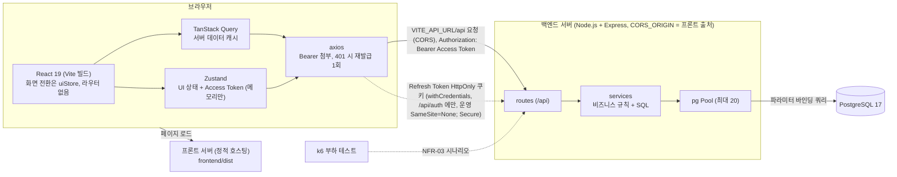

# team-caltalk 기술 아키텍처 다이어그램

## 문서 변경 이력

> 변경 시 표 맨 아래에 한 줄씩 누적 기록한다. 기존 행은 수정하지 않는다.

| 버전 | 변경자    | 변경내용                                                        | 변경일시         |
| ---- | --------- | --------------------------------------------------------------- | ---------------- |
| 0.1  | seungju18 | 기술 아키텍처 다이어그램 초안 작성                              | 2026-09-30       |
| 0.2  | seungju18 | 문서 정합성 점검: 기준 PRD v0.9, 5번 문서 v0.7 (내용 변경 없음) | 2026-09-30 14:47 |
| 0.3  | seungju18 | 운영 `CORS_ORIGIN` 비움 취지로 CORS 문구 수정, 기준 버전 갱신   | 2026-10-01       |
| 0.4  | seungju18 | 프론트·백엔드 분리 배포 반영 (PRD v0.15)                        | 2026-10-01       |

> 기준 문서: `docs/2-PRD.md` v0.15, `docs/5-project-principle.md` v1.4.

## 아키텍처

## 설명

- 브라우저 상태는 서버 데이터는 TanStack Query, UI 상태는 Zustand로 나눈다 (PRD 7.1).
- 화면 전환은 라우터 없이 Zustand `uiStore`의 페이지 상태로 한다 (PRD 7.2, 5번 문서 2.2).
- HTTP 호출은 axios가 맡고 Access Token 첨부와 401 재발급을 한 곳에서 처리한다 (PRD 7.1, 6.4).
- Access Token은 Zustand 메모리에만 두고, Refresh Token은 JS에서 읽을 수 없는 HttpOnly 쿠키로 `/api/auth`에만 전송한다 (PRD 6.4).
- 프론트와 백엔드는 별도 서버다. 프론트는 `VITE_API_URL`로 백엔드를 호출하고, 백엔드는 `CORS_ORIGIN`의 프론트 출처만 허용한다 (PRD 7.2, 5번 문서 5.3).
- 백엔드는 `routes` → `services` → `pg Pool` 순으로만 호출하며 SQL은 `services`에만 둔다 (5번 문서 2.3, NFR-05).
- DB는 PostgreSQL 17 하나이고 Refresh Token의 `jti`는 `refresh_tokens` 테이블에 저장한다 (PRD 7.1, 6.4).
- k6는 부하 테스트용 외부 도구라 점선으로 구분하며 앱 구성요소가 아니다 (PRD 7.2, NFR-03).
