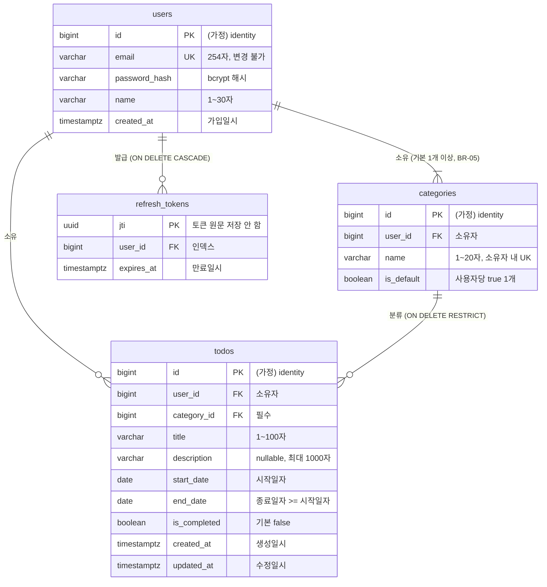

# ERD

## 문서 변경 이력

> 변경 시 표 맨 아래에 한 줄씩 누적 기록한다. 기존 행은 수정하지 않는다.

| 버전 | 변경자    | 변경내용                                                                                                   | 변경일시         |
| ---- | --------- | ---------------------------------------------------------------------------------------------------------- | ---------------- |
| 0.1  | seungju18 | ERD 초안 작성 (PRD v0.8, 도메인 정의서 v0.7 기준)                                                          | 2026-09-30       |
| 0.2  | seungju18 | 8번 문서 8장 결정 반영: `updated_at` 갱신 방식(2.3), 로그인 이력 테이블 미생성 확정(4장 1), 기준 PRD v0.10 | 2026-09-30 15:06 |

team-caltalk의 PostgreSQL 17 물리 데이터 모델이다. 도메인 정의서 3장(엔티티)과 PRD 6.4·7.3(물리 설계)을 근거로 작성했다.

> 기준 문서: `docs/2-PRD.md` v0.10, `docs/1-domain-definition.md` v0.7. `(가정)` 표시는 문서에 근거가 없지만 구현에 필요해서 이 문서에서 정한 값이다.
>
> 물리 이름 중 문서에 나온 것은 `users.created_at`, `todos`(PRD KPI-03), `refresh_tokens`, `jti`(PRD 6.4, 7.3)뿐이다. 나머지 테이블·컬럼 이름은 도메인 속성을 영문으로 옮긴 것이다 (가정).

## 1. ERD

## 2. 테이블별 컬럼

### 2.1 users

| 컬럼          | 타입           | 제약                                      | 근거                                                      |
| ------------- | -------------- | ----------------------------------------- | --------------------------------------------------------- |
| id            | `bigint`       | PK, `GENERATED ALWAYS AS IDENTITY` (가정) | 도메인 3.1 (시스템 생성). 타입은 가정                     |
| email         | `varchar(254)` | NOT NULL, UK                              | 도메인 3.1, BR-02, BR-16, OI-01, PRD 7.3                  |
| password_hash | `varchar(60)`  | NOT NULL                                  | 도메인 3.1, PRD NFR-07. 길이 60은 bcrypt 출력 길이 (가정) |
| name          | `varchar(30)`  | NOT NULL                                  | 도메인 3.1                                                |
| created_at    | `timestamptz`  | NOT NULL, DEFAULT `now()`                 | 도메인 3.1 (가입일시), PRD KPI-03                         |

### 2.2 categories

| 컬럼       | 타입          | 제약                                      | 근거                              |
| ---------- | ------------- | ----------------------------------------- | --------------------------------- |
| id         | `bigint`      | PK, `GENERATED ALWAYS AS IDENTITY` (가정) | 도메인 3.2. 타입은 가정           |
| user_id    | `bigint`      | NOT NULL, FK → users.id                   | 도메인 3.2, 3.4                   |
| name       | `varchar(20)` | NOT NULL, UK(user_id, name)               | 도메인 3.2, PRD 7.3               |
| is_default | `boolean`     | NOT NULL, DEFAULT `false` (가정)          | 도메인 3.2, BR-05, BR-17, PRD 7.3 |

### 2.3 todos

| 컬럼         | 타입            | 제약                                              | 근거                              |
| ------------ | --------------- | ------------------------------------------------- | --------------------------------- |
| id           | `bigint`        | PK, `GENERATED ALWAYS AS IDENTITY` (가정)         | 도메인 3.3. 타입은 가정           |
| user_id      | `bigint`        | NOT NULL, FK → users.id                           | 도메인 3.3, 3.4, PRD NFR-09       |
| category_id  | `bigint`        | NOT NULL, FK → categories.id `ON DELETE RESTRICT` | 도메인 3.3, BR-06, BR-18, PRD 7.3 |
| title        | `varchar(100)`  | NOT NULL                                          | 도메인 3.3                        |
| description  | `varchar(1000)` | NULL 허용                                         | 도메인 3.3 (선택)                 |
| start_date   | `date`          | NOT NULL                                          | 도메인 3.3, BR-07, PRD 7.3        |
| end_date     | `date`          | NOT NULL, `CHECK (end_date >= start_date)`        | 도메인 3.3, BR-08, PRD 7.3        |
| is_completed | `boolean`       | NOT NULL, DEFAULT `false`                         | 도메인 3.3 (기본값 미완료), BR-10 |
| created_at   | `timestamptz`   | NOT NULL, DEFAULT `now()`                         | 도메인 3.3, OI-09(PRD 9장 등록순) |
| updated_at   | `timestamptz`   | NOT NULL, DEFAULT `now()`                         | 도메인 3.3                        |

- 상태(시작 전/진행 중/완료/지연)는 저장하지 않고 조회 시 SQL `CASE`로 도출한다 (BR-10, PRD 7.3).
- `updated_at`은 트리거를 두지 않는다. 할일을 수정하는 `UPDATE` 쿼리가 `updated_at = now()`를 직접 설정한다 (8번 문서 8장).

### 2.4 refresh_tokens

| 컬럼       | 타입          | 제약                                        | 근거         |
| ---------- | ------------- | ------------------------------------------- | ------------ |
| jti        | `uuid`        | PK                                          | PRD 6.4, 7.3 |
| user_id    | `bigint`      | NOT NULL, FK → users.id `ON DELETE CASCADE` | PRD 6.4, 7.3 |
| expires_at | `timestamptz` | NOT NULL                                    | PRD 6.4, 7.3 |

## 3. 주요 제약 / 인덱스

| 대상           | 제약 / 인덱스                                                      | 근거                |
| -------------- | ------------------------------------------------------------------ | ------------------- |
| users          | `UNIQUE (email)`                                                   | BR-02, PRD 7.3      |
| categories     | `UNIQUE (user_id, name)`                                           | 도메인 3.2, PRD 7.3 |
| categories     | `CREATE UNIQUE INDEX ... ON categories (user_id) WHERE is_default` | BR-05, PRD 7.3      |
| todos          | `CHECK (end_date >= start_date)`                                   | BR-08, PRD 7.3      |
| todos          | FK `category_id` `ON DELETE RESTRICT`                              | BR-18, PRD 7.3      |
| todos          | 인덱스 `(user_id, end_date)` (컬럼 조합은 가정)                    | NFR-04, R-03, OI-09 |
| refresh_tokens | FK `user_id` `ON DELETE CASCADE`, 인덱스 `(user_id)`               | PRD 7.3             |

- 트랜잭션 처리 (DB 제약 아님, PRD 7.3·6.4): 회원가입 시 users + 기본 categories 생성, 카테고리 삭제 시 todos `UPDATE` → categories `DELETE`, Refresh 재발급 시 기존 jti 삭제 + 새 jti 저장.

## 4. 확인 필요 사항

| #   | 항목                       | 내용                                                                                                                                                                                                                       |
| --- | -------------------------- | -------------------------------------------------------------------------------------------------------------------------------------------------------------------------------------------------------------------------- |
| 1   | 로그인 이력 테이블 부재    | PRD KPI-04는 "로그인 성공 시 기록하는 로그인 이력"으로 측정한다고 하지만, 도메인 정의서·PRD 7.3 어디에도 해당 테이블 정의가 없다. **결정: 만들지 않는다.** KPI-04는 MVP에서 측정하지 않는다 (PRD v0.10 2.2, 8번 문서 8장). |
| 2   | PK 타입 미정               | 두 문서 모두 users·categories·todos의 ID 타입을 정하지 않았다. `bigint` identity로 가정했다 (`uuid`는 jti에만 명시).                                                                                                       |
| 3   | users 참조 FK의 ON DELETE  | categories.user_id, todos.user_id의 삭제 동작이 문서에 없다. 회원 탈퇴 미제공(OI-04)이라 기본값(`NO ACTION`)으로 둔다.                                                                                                     |
| 4   | BR-13 DB 수준 강제 여부    | "할일과 카테고리는 같은 소유자" 규칙은 PRD 7.3 DB 제약 목록에 없고 서버 검증(NFR-09)으로만 처리된다. 복합 FK로 DB에서 강제할지 결정 필요.                                                                                  |
| 5   | 문자열 비교 기준           | 이메일 UNIQUE(BR-02)와 카테고리 이름 UNIQUE의 대소문자 구분 여부, 저장 전 앞뒤 공백 제거(도메인 3장 길이 기준) 여부가 문서에 없다.                                                                                         |
| 6   | refresh_tokens는 도메인 외 | refresh_tokens는 도메인 정의서 엔티티에 없고 PRD 6.4·7.3에서만 정의된다. PRD 물리 설계를 따랐다.                                                                                                                           |
| 7   | 비밀번호 속성 표현 차이    | 도메인 3.1은 "비밀번호" 속성, PRD NFR-07은 bcrypt 해시 저장이다. 물리 컬럼은 `password_hash`로 두었다 (PRD 기준).                                                                                                          |
| 8   | description 빈 값 표현     | "선택" 입력이 비었을 때 `NULL`과 빈 문자열 중 무엇으로 저장할지 문서에 없다. `NULL` 허용으로 두었다.                                                                                                                       |
