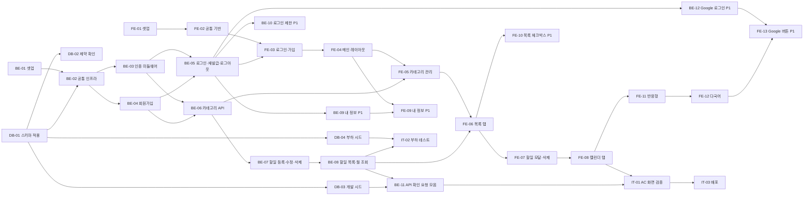

# team-caltalk 작업 실행 계획 (WBS)

## 문서 변경 이력

> 변경 시 표 맨 아래에 한 줄씩 누적 기록한다. 기존 행은 수정하지 않는다. 삭제된 Task ID는 재사용하지 않는다.

| 버전 | 변경자    | 변경내용                                                                                                                                               | 변경일시         |
| ---- | --------- | ------------------------------------------------------------------------------------------------------------------------------------------------------ | ---------------- |
| 0.1  | seungju18 | 작업 실행 계획 초안 작성                                                                                                                               | 2026-09-30       |
| 0.2  | seungju18 | 8장 착수 전 확인 사항 6건 결정 및 관련 문서 반영, 3장 API 경로 확정(상세는 `swagger.json`), BE-01·BE-06·BE-09·BE-10·FE-08을 결정·`swagger.json`에 맞춤 | 2026-09-30 15:06 |
| 0.3  | seungju18 | DB-01~DB-04 완료 조건 체크 (DB-03 BE-05 로그인 항목 제외)                                                                                              | 2026-09-30       |
| 0.4  | seungju18 | 스키마 파일 이동에 따라 기준 문서·DB-01 관련 경로를 `backend/db/schema.sql`로 수정                                                                     | 2026-09-30       |
| 0.5  | seungju18 | BE-01 완료 조건 체크                                                                                                                                   | 2026-09-30       |
| 0.6  | seungju18 | BE-02 완료 조건 체크                                                                                                                                   | 2026-10-01       |
| 0.7  | seungju18 | BE-03~BE-11 완료 조건 체크 (BE-09 변경 기기 유지 항목 제외)                                                                                            | 2026-10-01       |
| 0.8  | seungju18 | BE-09 변경 기기 유지 조건에 재사용 감지 예외를 명시하고 체크                                                                                           | 2026-10-01       |
| 0.9  | seungju18 | DB-03 시드 계정 로그인 항목 체크                                                                                                                       | 2026-10-01       |
| 1.0  | seungju18 | BE-03 인증 예외에 개발 전용 API 문서(`/api-docs`) 추가                                                                                                 | 2026-10-01       |
| 1.1  | seungju18 | API 명세 위치를 `backend/swagger.yaml`로 수정, 자동화 테스트·CORS 환경 변수·응답 세부(3장) 반영, 기준 문서 버전 갱신                                   | 2026-10-01       |
| 1.2  | seungju18 | 3장 응답 세부를 `swagger.yaml`에 반영했음을 표기                                                                                                       | 2026-10-01       |
| 1.3  | seungju18 | FE-01 완료 조건 체크 | 2026-10-01       |
| 1.4  | seungju18 | 테마 전환 반영: FE-02 uiStore 테마·`localStorage` 조건, FE-04 헤더 [테마] 버튼 (PRD v0.12) | 2026-10-01       |
| 1.5  | seungju18 | FE-02~FE-11 완료 조건 체크 | 2026-10-01       |
| 1.6  | seungju18 | FE-12 다국어(한국어·영어) Task 추가 (PRD v0.13) | 2026-10-01       |
| 1.7  | seungju18 | FE-12 완료 조건 체크 | 2026-10-01       |
| 1.8  | seungju18 | BE-12 Google 로그인, FE-13 Google 버튼 Task와 API 경로 추가 (PRD v0.14) | 2026-10-01       |
| 1.9  | seungju18 | BE-12 완료 조건, FE-13 첫 조건 체크 (나머지는 Google 클라이언트 ID 발급 후 확인) | 2026-10-01       |
| 1.10 | seungju18 | IT-03을 프론트·백엔드 분리 배포로 변경 (PRD v0.15) | 2026-10-01       |
| 1.11 | seungju18 | FE-01 프록시 항목에 PRD v0.16 프록시 제거 주석 추가 | 2026-10-01       |
| 1.12 | seungju18 | 구현 반영: 8장 자동화 테스트 결정에 프론트 `frontend/test` 추가, 기준 문서 버전 갱신 | 2026-10-02       |
| 1.13 | seungju18 | FE-13 나머지 완료 조건(Google 버튼 표시·로그인, 미가입 계정 안내) 체크 | 2026-10-02       |

> 기준 문서: `docs/1-domain-definition.md` v0.8, `docs/2-PRD.md` v0.17, `docs/3-user-scenario.md` v0.4, `docs/4-wireframes.md` v0.6, `docs/5-project-principle.md` v1.7, `docs/6-arch-diagram.md` v0.4, `docs/7-erd.md` v0.4, `backend/db/schema.sql`, `backend/swagger.yaml`. 기능·규칙은 기준 문서를 원본으로 하고 이 문서에서는 ID로만 참조한다. `(가정)` 표시는 기준 문서에 근거가 없어 이 문서에서 정한 내용이다.

## 1. 계획 원칙

- Task는 **DB / BE(백엔드) / FE(프론트엔드) / IT(통합·검증)** 4개 영역으로 나눈다. IT는 세 영역이 모두 모여야 끝나는 검증·배포 작업만 담는다.
- Task 하나는 반나절 이내 분량이고, 완료 조건을 혼자 확인할 수 있어야 한다.
- 일정은 PRD 8장(2일, 1인)을 따른다. 일정이 밀리면 PRD 8장 절단 순서(FR-15 → NFR-11 → FR-14 → FR-13 → NFR-13)대로 P1 Task를 뺀다. P0 Task는 빼지 않는다.
- 코드 위치·레이어·명명 규칙은 5번 문서(프로젝트 구조 설계 원칙)를 따른다.

**모든 Task 공통 완료 조건** (각 Task에서 반복하지 않는다)

- [ ] 해당 패키지에서 `tsc --noEmit` 오류 0건 (5번 문서 4장 9)
- [ ] 5번 문서 2장·3장의 "확인 방법" 중 해당 Task 코드에 걸리는 항목 위반 0건
- [ ] 규칙을 구현한 코드에 근거 ID 주석(`// BR-08` 등)이 있다 (5번 문서 1장 1)

## 2. 전체 일정과 의존 관계

| 일정       | DB           | BE                   | FE            | IT           |
| ---------- | ------------ | -------------------- | ------------- | ------------ |
| Day 1 오전 | DB-01, DB-02 | BE-01, BE-02         | FE-01         | -            |
| Day 1 오후 | DB-03        | BE-03 ~ BE-08, BE-11 | FE-02         | -            |
| Day 2 오전 | -            | -                    | FE-03 ~ FE-08 | IT-01        |
| Day 2 오후 | DB-04        | BE-09, BE-10 (P1)    | FE-09 ~ FE-11 | IT-02, IT-03 |

- 임계 경로: BE-01 → BE-02 → BE-03 → BE-05 → FE-03 → FE-04 → FE-05 → FE-06 → FE-07 → FE-08 → IT-01 → IT-03.
- FE-01, FE-02는 백엔드와 병행할 수 있다. FE-02의 401 재발급 처리는 BE-05 완료 후 실제 동작을 확인한다.

## 3. API 경로

기준 문서는 `/api/auth/refresh`, `/api/auth/logout`, `/api/health`만 정했다. BE와 FE가 독립적으로 작업하도록 나머지 경로를 이 문서에서 아래로 확정한다. 요청·응답 스키마와 상태 코드는 `backend/swagger.yaml`이 원본이다. 응답 JSON 필드는 camelCase, 상태 값은 `not_started` / `in_progress` / `done` / `overdue`다 (5번 문서 3.1).

| 메서드 | 경로                                       | 기능                                | 인증 | Task  |
| ------ | ------------------------------------------ | ----------------------------------- | ---- | ----- |
| GET    | `/api/health`                              | 헬스체크                            | 없음 | BE-02 |
| POST   | `/api/auth/signup`                         | 회원가입 (FR-01)                    | 없음 | BE-04 |
| POST   | `/api/auth/login`                          | 로그인 (FR-02)                      | 없음 | BE-05 |
| POST   | `/api/auth/google`                         | Google 로그인 (FR-18)               | 없음 | BE-12 |
| POST   | `/api/auth/refresh`                        | 재발급 (FR-04, PRD 6.4)             | 쿠키 | BE-05 |
| POST   | `/api/auth/logout`                         | 로그아웃 (FR-03)                    | 쿠키 | BE-05 |
| GET    | `/api/users/me`                            | 내 정보 조회 (헤더 이름 표시, 가정) | 필요 | BE-05 |
| PATCH  | `/api/users/me`                            | 이름 변경 (FR-13)                   | 필요 | BE-09 |
| PUT    | `/api/users/me/password`                   | 비밀번호 변경 (FR-13)               | 필요 | BE-09 |
| GET    | `/api/categories`                          | 카테고리 목록 (FR-05)               | 필요 | BE-06 |
| POST   | `/api/categories`                          | 카테고리 생성 (FR-06)               | 필요 | BE-06 |
| PATCH  | `/api/categories/:id`                      | 카테고리 이름 변경 (FR-16)          | 필요 | BE-06 |
| DELETE | `/api/categories/:id`                      | 카테고리 삭제 (FR-17)               | 필요 | BE-06 |
| POST   | `/api/todos`                               | 할일 등록 (FR-07)                   | 필요 | BE-07 |
| PATCH  | `/api/todos/:id`                           | 할일 수정·완료 토글 (FR-08, FR-14)  | 필요 | BE-07 |
| DELETE | `/api/todos/:id`                           | 할일 삭제 (FR-09)                   | 필요 | BE-07 |
| GET    | `/api/todos?filter=&categoryId=&today=`    | 목록·필터 (FR-10)                   | 필요 | BE-08 |
| GET    | `/api/todos/calendar?month=YYYY-MM&today=` | 월 조회 (FR-11)                     | 필요 | BE-08 |

- `/api-docs`는 개발 환경(`NODE_ENV !== production`)에서만 열리고 인증이 없다. CDN의 swagger-ui로 `backend/swagger.yaml`을 보여준다 (`routes/docsRoutes.ts`, BE-03).
- 구현에서 정한 응답 세부 (가정, `swagger.yaml`에도 반영):
  - 본문이 비어 있는 `PATCH /api/todos/:id`는 400, field `body`다.
  - `categoryId`와 `all`이 아닌 `filter`를 함께 지정한 목록 조회는 400, field `filter`다.
  - '기본' 카테고리의 이름 변경·삭제는 400, field `name`이다.
  - 로그인 제한(429)이 걸리면 올바른 비밀번호로 요청해도 1분간 거부한다.
  - 이메일은 앞뒤 공백만 제거하고 대소문자는 그대로 쓴다 (7-erd 4장 5).

## 4. 데이터베이스 (DB)

### DB-01 스키마 파일 배치 및 적용

- **선행 Task:** 없음 (PostgreSQL 17 인스턴스 필요)
- **관련:** 7-erd, `backend/db/schema.sql`, 5번 문서 5.3, PRD 7.3
- **수행 작업:**
  - `docs/schema.sql`을 `backend/db/schema.sql`로 옮기고 스키마의 유일한 원본으로 삼는다 (5번 문서 5.3). `docs/`에는 남기지 않는다.
  - 로컬 PostgreSQL 17에 개발용 DB를 만들고 `schema.sql`을 수동 적용한다.
  - 적용 방법(명령 1줄)을 `backend/db/schema.sql` 상단 주석에 적는다.
- **완료 조건:**
  - [x] `backend/db/schema.sql`만 존재하고 `docs/schema.sql`은 없다
  - [x] 빈 DB에 `schema.sql` 적용이 오류 없이 끝난다
  - [x] `users`, `categories`, `todos`, `refresh_tokens` 4개 테이블이 생성되어 있다
  - [x] 인덱스 `categories_user_id_default_key`, `todos_user_id_end_date_idx`, `refresh_tokens_user_id_idx`가 존재한다

### DB-02 DB 제약 동작 확인

- **선행 Task:** DB-01
- **관련:** BR-02, BR-05, BR-08, BR-18, 5번 문서 4장 5
- **수행 작업:** 서버를 거치지 않고 SQL로 잘못된 데이터를 넣어 DB 제약이 막는지 확인한다. 확인 후 데이터는 롤백한다.
- **완료 조건:**
  - [x] 같은 `email` 두 번 INSERT 시 UNIQUE 위반으로 실패한다 (BR-02)
  - [x] 같은 사용자에 같은 이름 카테고리 INSERT 시 실패한다 (도메인 3.2)
  - [x] 같은 사용자에 `is_default = true` 카테고리 2개 INSERT 시 실패한다 (BR-05)
  - [x] `end_date < start_date` 할일 INSERT 시 CHECK 위반으로 실패한다 (BR-08)
  - [x] 할일이 있는 카테고리 DELETE 시 FK `RESTRICT`로 실패한다 (BR-18)
  - [x] 사용자 DELETE 시 해당 `refresh_tokens` 행이 함께 삭제된다 (`CASCADE`)

### DB-03 개발용 시드 데이터

- **선행 Task:** DB-01
- **관련:** 도메인 정의서 5.2 예시 데이터, 5번 문서 4장 3·4
- **수행 작업:**
  - `backend/db/seed.sql`(가정)을 작성한다. 사용자 2명(본인, 다른 사용자), 각자 '기본' 카테고리, 본인의 '업무' 카테고리, 할일 A~F(도메인 5.2 그대로), 다른 사용자의 할일 1건.
  - 비밀번호는 알려진 값의 bcrypt 해시(cost 10)를 미리 계산해 넣는다. 평문은 파일 주석에만 적는다 (개발용).
- **완료 조건:**
  - [x] 빈 스키마에 `seed.sql` 적용이 오류 없이 끝난다
  - [x] 본인 할일 6건(A~F)의 카테고리·시작일자·종료일자·완료 여부가 도메인 5.2 표와 일치한다
  - [x] 다른 사용자의 할일 1건이 존재한다 (AC-08-8 확인용)
  - [x] 시드 계정으로 BE-05 로그인이 성공한다 (BE-05 완료 후 확인)

### DB-04 부하 테스트 사전 데이터

- **선행 Task:** DB-01
- **관련:** NFR-03, 5번 문서 4장 6
- **수행 작업:** `loadtest/seed.sql`(가정)에 `generate_series`로 사용자 1,000명 × 할일 100건을 만든다. 모든 사용자는 같은 비밀번호 해시와 '기본' 카테고리 1개를 가진다. 날짜는 부하 테스트 실행 월 전후에 분산한다.
- **완료 조건:**
  - [x] 적용 후 `users` 1,000행, `todos` 100,000행, 사용자당 기본 카테고리 1개다
  - [x] 적용 시간이 1분 이내다 (가정)
  - [x] 임의 사용자 1명의 목록 조회 쿼리 `EXPLAIN`이 `todos_user_id_end_date_idx`를 사용한다 (NFR-04)

## 5. 백엔드 (BE)

### BE-01 백엔드 프로젝트 셋업

- **선행 Task:** 없음
- **관련:** PRD 7.1·7.2, 5번 문서 5.1·6.3
- **수행 작업:**
  - `backend/`에 `package.json`, `tsconfig.json`을 만든다. 의존성: `express`, `pg`, `jsonwebtoken`, `bcrypt`, `cookie-parser`와 각 타입 패키지, `typescript`. 그 외 추가 금지 (5번 문서 1장 3).
  - 스크립트: `dev` = `node --watch src/server.ts`, `start` = `node src/server.ts`, `typecheck` = `tsc --noEmit`, `test` = Node 내장 `node --test`(`--test-concurrency=1`, `--experimental-test-coverage`, `test/*.test.ts`). 빌드 단계는 없다 (PRD 7.2 백엔드 TS 실행). `tsconfig.json`은 `noEmit`, `allowImportingTsExtensions`, `erasableSyntaxOnly`, `verbatimModuleSyntax`를 켠다.
  - `src/config.ts`: 환경 변수(`DATABASE_URL`, `PORT`, `NODE_ENV`, `JWT_ACCESS_SECRET`, `JWT_REFRESH_SECRET`) 읽기·필수 검증, 선택 환경 변수 `CORS_ORIGIN`(쉼표 구분, 비우면 CORS 헤더 없음), PRD 튜닝 상수(bcrypt cost 10, 풀 20, 본문 100KB, 토큰 15분/7일).
  - `.env.example`(값 없음)을 만들고 `.env`는 `.gitignore`에 넣는다.
- **완료 조건:**
  - [x] `npm install` 후 `npm run typecheck`가 성공하고 `npm run dev`로 서버가 시작된다
  - [x] 의존성에 `tsx`, `ts-node` 등 TS 실행 도구가 없다
  - [x] 필수 환경 변수 하나라도 없으면 서버가 시작하지 않고 누락 이름을 출력한다
  - [x] `package.json`에 ORM·검증 라이브러리·라우터 외 프레임워크가 없다
  - [x] `.env`가 Git 추적 대상이 아니다

### BE-02 공통 인프라 (DB 연결, 오류, 앱 조립, 헬스체크)

- **선행 Task:** BE-01, DB-01
- **관련:** NFR-05, NFR-10, PRD 7.3, 5번 문서 2.3·3.4·6.3
- **수행 작업:**
  - `src/db.ts`: pg `Pool`(최대 20), DATE(OID 1082) 문자열 파서, 트랜잭션 헬퍼 1개.
  - `src/errors.ts`: 400(항목별 사유 포함) / 401 / 404 오류 클래스.
  - `src/app.ts`: `CORS_ORIGIN`에 있는 출처에만 CORS 헤더 설정(의존성 없이 직접), JSON 본문 100KB 제한, `cookie-parser`, 라우터 마운트, 최종 오류 핸들러 1개. `src/server.ts`: listen.
  - `routes/healthRoutes.ts`: `GET /api/health`가 DB에 `SELECT 1` 후 200.
- **완료 조건:**
  - [x] `GET /api/health`가 200을 반환한다 (PRD 8장 Day 1 오전 완료 기준)
  - [x] DB의 `date` 컬럼 조회 결과가 JS `Date`가 아니라 `YYYY-MM-DD` 문자열이다
  - [x] 100KB 초과 본문 요청이 413으로 거부된다
  - [x] 처리되지 않은 예외가 500 JSON 응답이 되고 서버가 죽지 않는다
  - [x] `new Pool` 호출이 `db.ts` 한 곳에만 있다

### BE-03 Access Token 검증 미들웨어

- **선행 Task:** BE-02
- **관련:** BR-01, NFR-06, NFR-09, PRD 6.4, 5번 문서 5.2
- **수행 작업:** `middleware/auth.ts`: `Authorization: Bearer` 추출, `HS256` 고정·`type = "access"` 확인, 성공 시 요청에 사용자 ID(`sub`) 설정, 실패 시 401. 인증 필요 라우터에 라우터 단위로 적용한다.
- **완료 조건:**
  - [x] 헤더 없음·만료·위조·`type = "refresh"` 토큰 모두 401이다
  - [x] `alg: none` 또는 다른 알고리즘 토큰이 거부된다
  - [x] 유효한 토큰이면 핸들러에서 사용자 ID를 읽을 수 있다
  - [x] 인증 없이 열린 경로는 가입·로그인·재발급·로그아웃·헬스체크뿐이다 (예외: 개발 환경 전용 API 문서 `/api-docs`)

### BE-04 회원가입 API

- **선행 Task:** BE-02
- **관련:** FR-01, UC-01, BR-02, BR-05, BR-11, NFR-07, NFR-10
- **수행 작업:**
  - `validators/authValidator.ts`: 이메일 형식·254자, 비밀번호 8~64자·영문·숫자 각 1자 이상, 이름 1~30자(앞뒤 공백 제거 기준). 제약 수치는 `validators/`에서만 정의한다.
  - `services/authService.ts`: 트랜잭션으로 사용자(bcrypt 해시) + '기본' 카테고리(`is_default = true`) 생성.
  - `POST /api/auth/signup`. 중복 이메일은 400 + 이메일 항목 사유.
- **완료 조건:**
  - [x] 정상 가입 시 `users` 1행과 `is_default = true` 카테고리 1행이 생긴다
  - [x] 중복 이메일은 400이고 사유가 이메일 항목에 달린다 (BR-02, SC-01 2a)
  - [x] 제약 위반은 400 + 위반 항목별 사유이며 DB에 행이 생기지 않는다 (BR-11, SC-01 2b)
  - [x] 카테고리 생성이 실패하면 사용자도 생성되지 않는다 (트랜잭션)
  - [x] DB에 비밀번호 평문이 없다

### BE-05 로그인·재발급·로그아웃·내 정보 조회 API

- **선행 Task:** BE-03, BE-04
- **관련:** FR-02~04, UC-02, UC-11, BR-14, PRD 6.4, R-04
- **수행 작업:**
  - 로그인: 비동기 `bcrypt.compare`, Access(15분)·Refresh(7일, `jti` UUID) 발급, `jti` 저장, 같은 사용자의 만료된 Refresh 행 삭제. Access는 본문, Refresh는 `HttpOnly; SameSite=Strict; Path=/api/auth` 쿠키(운영 `Secure`).
  - 재발급: 서명·만료·`type` 검증 → `jti` 존재 확인 → 트랜잭션으로 삭제 + 새 `jti` 저장(회전) → 새 Access·Refresh. `jti`가 없으면 해당 사용자 Refresh 전부 삭제 후 401(재사용 감지).
  - 로그아웃: 해당 `jti` 삭제, 쿠키 삭제.
  - `GET /api/users/me`: 이메일·이름 반환 (가정).
- **완료 조건:**
  - [x] 로그인 실패는 이메일 없음·비밀번호 틀림 모두 같은 상태 코드·같은 문구다 (BR-14)
  - [x] 로그인 응답 본문에 Access, `Set-Cookie`에 Refresh가 있고 쿠키 속성이 PRD 6.4와 같다
  - [x] 재발급 후 이전 Refresh로 다시 재발급하면 401이고 그 사용자의 Refresh 행이 0개가 된다
  - [x] 로그아웃 후 같은 Refresh로 재발급하면 401이다
  - [x] `refresh_tokens`에 토큰 원문이 없다
  - [x] 로그에 비밀번호·토큰·`Authorization` 값이 출력되지 않는다

### BE-06 카테고리 API

- **선행 Task:** BE-03, BE-04
- **관련:** FR-05, FR-06, FR-16, FR-17, UC-04, UC-12~14, BR-03, BR-17, BR-18, AC-10
- **수행 작업:**
  - `validators/categoryValidator.ts`: 이름 1~20자.
  - `services/categoryService.ts`: 목록(본인만), 생성, 이름 변경, 삭제. 모든 쿼리에 `user_id = sub` 조건. '기본' 변경·삭제는 거부. 삭제는 트랜잭션으로 소속 할일 `category_id`를 본인 '기본'으로 `UPDATE` 후 `DELETE`.
  - `routes/categoryRoutes.ts`: 3장 경로.
- **완료 조건:**
  - [x] 목록에 본인 카테고리만 있고 '기본'이 포함된다
  - [x] 소유자 내 중복 이름은 생성·변경 모두 400이다. 다른 사용자와 같은 이름은 허용된다 (AC-10-2, SC-10 2b)
  - [x] '기본' 이름 변경·삭제 요청이 400으로 거부되고 데이터가 바뀌지 않는다 (AC-10-4)
  - [x] '업무' 삭제 후 A, B의 카테고리가 '기본'이고 할일은 6건 그대로다 (AC-10-3)
  - [x] 다른 사용자의 카테고리 ID로 변경·삭제하면 404다 (BR-03)

### BE-07 할일 등록·수정·삭제 API

- **선행 Task:** BE-06
- **관련:** FR-07~09, FR-14, UC-05~07, BR-06, BR-08, BR-11, BR-13, AC-05~07
- **수행 작업:**
  - `validators/todoValidator.ts`: 제목 1~100자, 설명 최대 1000자(빈 값은 `NULL`), 날짜 `YYYY-MM-DD`, 종료일자 >= 시작일자.
  - `services/todoService.ts`: 등록(카테고리 없으면 본인 '기본', 지정 시 본인 카테고리인지 확인), 수정(부분 수정, 완료/완료 해제 포함, `updated_at = now()` 직접 설정), 삭제. 모든 쿼리에 `user_id = sub` 조건.
  - `PATCH`는 보낸 필드만 바꾼다 (FR-14 완료 토글이 같은 경로 사용).
- **완료 조건:**
  - [x] 카테고리 미지정 등록 시 '기본'이 적용된다 (AC-05-2)
  - [x] 시작일자 = 종료일자는 저장되고, 종료일자 < 시작일자는 400이다 (AC-05-3, AC-05-4)
  - [x] 제목 공백만 있으면 400 + 제목 사유다 (AC-05-5)
  - [x] 다른 사용자의 카테고리 ID 지정 시 거부된다 (BR-13, SC-04 3f)
  - [x] 다른 사용자의 할일 ID 수정·삭제는 404이고 데이터가 바뀌지 않는다 (AC-06-4, AC-07-3)
  - [x] 수정 거부 시 저장된 값이 바뀌지 않는다 (AC-06-3)
  - [x] 수정 성공 시 `updated_at`이 갱신된다

### BE-08 할일 목록(필터)·월 조회 API

- **선행 Task:** BE-07
- **관련:** FR-10, FR-11, UC-08, UC-09, BR-10, BR-12, OI-05, OI-09, NFR-04, NFR-08, AC-08, AC-09
- **수행 작업:**
  - `today`(필수, `YYYY-MM-DD` 형식만 검증) 기준 상태를 SQL `CASE`로 도출해 응답에 포함한다. 서버 시계로 오늘을 구하지 않는다.
  - 목록: `filter`(`all` / `not_started` / `in_progress` / `done` / `overdue`)와 `categoryId`(단일 선택, 가정: 둘 중 하나만) 를 허용 목록에서 SQL 조건으로 매핑. 정렬 종료일자 오름차순, 같으면 `created_at` 순.
  - 월 조회: `month`(`YYYY-MM`)로 `start_date <= 말일 AND end_date >= 1일` (BR-12).
- **완료 조건:**
  - [x] 시드 데이터·`today=2026-10-01`로 AC-08-1~AC-08-6 결과가 일치한다
  - [x] `today=2026-10-02` '지연' 결과가 A, C다 (AC-08-7)
  - [x] 다른 사용자의 할일은 어떤 조건에서도 나오지 않는다 (AC-08-8)
  - [x] `month=2026-10`은 B, C, D, E, `month=2026-09`는 A, B, F다 (AC-09-1, AC-09-2)
  - [x] 허용 목록 밖 `filter`·잘못된 `today`·`month` 형식은 400이다
  - [x] 서비스 코드에 필터용 `Array.filter`, 오늘 계산용 `new Date()`가 없다

### BE-09 내 정보 수정·비밀번호 변경 API (P1)

- **선행 Task:** BE-05
- **관련:** FR-13, UC-03, BR-04, BR-15, BR-16, PRD 6.4
- **수행 작업:** `PATCH /api/users/me`(이름만, 이메일 필드는 무시), `PUT /api/users/me/password`(현재 비밀번호 확인 → 새 해시 저장 → 해당 사용자 Refresh 전부 삭제 → 현재 기기에 새 Access·Refresh 발급).
- **완료 조건:**
  - [x] 이름 제약 위반은 400이다 (SC-12 2a)
  - [x] 이메일은 어떤 요청으로도 바뀌지 않는다 (BR-16)
  - [x] 현재 비밀번호 불일치는 거부되고 해시가 바뀌지 않는다 (BR-15)
  - [x] 변경 후 다른 기기의 기존 Refresh로 재발급하면 401이다 (SC-12 4)
  - [x] 변경한 기기는 응답으로 받은 새 토큰으로 계속 요청할 수 있다. 단, 이후 다른 기기가 옛 Refresh로 재발급하면 재사용 감지(PRD 6.4)로 변경한 기기의 Refresh도 삭제되어 Access 만료 후 재로그인이 필요하다 (단일 기기 사용 전제로 허용)

### BE-10 로그인 실패 횟수 제한 (P1)

- **선행 Task:** BE-05
- **관련:** NFR-11, SC-02 1b
- **수행 작업:** `middleware/loginLimit.ts`: IP별 메모리 카운터, 분당 실패 10회 초과 시 일시 거부. 로그인 경로에만 적용.
- **완료 조건:**
  - [x] 같은 IP에서 1분 안에 11번째 실패 요청이 429로 거부된다
  - [x] 1분이 지나면 다시 로그인을 시도할 수 있다
  - [x] 다른 IP는 영향을 받지 않는다

### BE-11 API 수동 확인 요청 모음

- **선행 Task:** BE-06, BE-08, DB-03
- **관련:** PRD 8장 Day 1 오후 완료 기준, 5번 문서 4장 2
- **수행 작업:** `backend/requests/`에 AC 항목별 요청과 기대 응답을 정리한다. 형식은 편집기에서 바로 실행 가능한 `.http` 파일로 한다 (가정): `requests/auth.http`, `requests/ac.http`. 같은 판정은 `backend/test/*.test.ts`(`npm test`)로도 자동 확인한다.
- **완료 조건:**
  - [x] AC-05 ~ AC-10의 서버 측 판정(저장 거부, 404, 필터 결과, 월 포함 결과, 카테고리 변경·삭제)마다 요청이 1개 이상 있다
  - [x] 시드 데이터 기준으로 모든 요청의 실제 응답이 기대 응답과 같다
  - [x] 소유권 차단(AC-06-4, AC-07-3, AC-08-8, BR-13) 요청이 포함되어 있다

### BE-12 Google 로그인 (P1)

- **선행 Task:** BE-05
- **관련:** FR-18, BR-19, REQ-14
- **수행 작업:** `google-auth-library` 추가. `users.google_sub` 컬럼(`schema.sql` + 개발 DB 적용). `POST /api/auth/google { credential }`: ID 토큰 검증(`aud` = `GOOGLE_CLIENT_ID`, `email_verified`) → `google_sub`로 사용자 조회 → 없으면 이메일로 조회해 연결 → 로그인 성공 처리는 BE-05 재사용. 오류: credential 누락 400, 검증 실패·다른 Google 계정 연결됨 401, 가입된 계정 없음 404. `swagger.yaml`·`requests/auth.http` 반영.
- **완료 조건:**
  - [x] 가입된 이메일의 Google 계정으로 처음 로그인하면 `google_sub`가 저장되고 200 + Refresh 쿠키가 온다
  - [x] 가입되지 않은 이메일이면 404이고 사용자가 만들어지지 않는다
  - [x] 검증 실패, `email_verified` false, 다른 Google 계정이 이미 연결된 계정은 401이다
  - [x] Google 검증을 대체한 `npm test` 케이스가 통과한다

## 6. 프론트엔드 (FE)

### FE-01 프론트엔드 프로젝트 셋업

- **선행 Task:** 없음
- **관련:** PRD 7.1·7.2·7.4, 5번 문서 5.3·6.2
- **수행 작업:**
  - Vite로 React 19 + TS 프로젝트를 `frontend/`에 만든다. 의존성: `zustand@5`, `@tanstack/react-query@5`, `axios@1`, `tailwindcss@4`, `@tailwindcss/vite`. 그 외 추가 금지.
  - `vite.config.ts`: Tailwind 플러그인, `/api` 프록시(백엔드 포트). (이후 PRD v0.16에서 프록시 제거, `VITE_API_URL`로 직접 호출)
  - `src/index.css`에 `@import "tailwindcss";`만 두고 `main.tsx`에서만 import. `api/queryClient.ts` 단일 인스턴스 + `QueryClientProvider`.
- **완료 조건:**
  - [x] `npm run dev`로 빈 화면이 뜨고 Tailwind 클래스가 적용된다
  - [x] 개발 서버에서 `/api/health` 요청이 백엔드로 프록시된다 (BE-02 완료 후 확인)
  - [x] `.css` 파일이 `src/index.css` 하나뿐이다
  - [x] `package.json`에 라우터·`clsx`·date picker·CSS-in-JS 라이브러리가 없다

### FE-02 공통 기반 (store, API 클라이언트, 공통 컴포넌트)

- **선행 Task:** FE-01
- **관련:** FR-04, PRD 6.4·7.4, 5번 문서 2.2·6.2
- **수행 작업:**
  - `stores/authStore.ts`(Access Token 메모리, 로그인 여부), `stores/uiStore.ts`(현재 페이지 초기값 `login`, 탭, 필터, 캘린더 월, 열린 모달, 테마). 테마 초기값은 `localStorage`의 `theme`(`dark`면 다크, 그 외 라이트)이고, 전환 시 `<html>`의 `dark` 클래스와 `localStorage`를 함께 바꾼다 (PRD 7.2 테마).
  - `api/client.ts`: 요청 인터셉터 Bearer 첨부, 응답 인터셉터 401 시 재발급 1회 후 재시도. 동시 401은 진행 중 재발급 Promise 1개를 공유. 재발급 실패 시 authStore 초기화 + `queryClient.clear()` + 페이지 `login`.
  - `api/auth.ts`, `todos.ts`, `categories.ts`, `users.ts`: 3장 경로 호출 함수와 응답 타입.
  - `lib/date.ts`(로컬 오늘 `YYYY-MM-DD`, 월 그리드 계산), `lib/validation.ts`(3장 제약, BR-08 화면 검증).
  - `components/Button.tsx`, `Input.tsx`, `Badge.tsx`, `ConfirmDialog.tsx`.
- **완료 조건:**
  - [x] `localStorage`·`sessionStorage` 사용처가 테마 1건(`uiStore`, `index.html` 초기 적용)뿐이다
  - [x] `axios` import가 `api/` 밖에 없고, 재발급 호출 코드가 `client.ts` 한 곳에만 있다
  - [x] 동시에 3개 요청이 401이면 재발급 요청이 1번만 나간다 (BE-05 완료 후 확인, SC-03 A2a)
  - [x] `lib/date.ts`의 오늘 계산이 로컬 시간대 기준이다 (OI-05)
  - [x] store에 할일·카테고리 목록 필드가 없다

### FE-03 로그인·회원가입 화면과 앱 시작 복구

- **선행 Task:** FE-02, BE-05
- **관련:** WF-01, WF-02, FR-01, FR-02, FR-04, SC-01~03, BR-14
- **수행 작업:**
  - `hooks/useAuth.ts`: 가입·로그인·로그아웃 `useMutation`, 인증 상태.
  - `pages/LoginPage.tsx`, `pages/SignupPage.tsx`: WF-01·02 구성, 서버 항목별 사유를 입력란에 매핑, 제출 중 버튼 비활성.
  - `App.tsx`: 앱 시작 시 재발급 1회 시도. 확인 중에는 "불러오는 중", 성공 시 메인, 실패 시 로그인.
- **완료 조건:**
  - [x] 가입 성공 시 로그인 화면으로 이동하고 완료 안내 1줄이 보인다 (WF-02)
  - [x] 중복 이메일·제약 위반 사유가 해당 입력란 아래에 보이고 입력값이 유지된다 (SC-01 2a·2b)
  - [x] 로그인 실패 시 "식별자 또는 비밀번호가 올바르지 않습니다"만 보이고 이메일은 유지된다 (BR-14)
  - [x] 로그인 상태에서 새로고침하면 로그인 화면을 거치지 않고 메인이 보인다 (SC-03 흐름 B)
  - [x] Refresh 쿠키가 없으면 새로고침 후 로그인 화면이다 (SC-03 3a)

### FE-04 메인 레이아웃 (헤더, 탭, 화면 전환)

- **선행 Task:** FE-03
- **관련:** WF-03·04 공통 헤더, FR-03, FR-12, UC-10, UC-11
- **수행 작업:** `components/Header.tsx`(이름 표시는 `GET /api/users/me`, [카테고리] [내 정보] [테마] [로그아웃]), `pages/MainPage.tsx`(목록/캘린더 탭, [+ 새 할일] 자리), uiStore 페이지 전환으로 `CategoryPage`, `ProfilePage` 진입·복귀(직전 탭 유지).
- **완료 조건:**
  - [x] 헤더에 로그인한 사용자 이름이 보인다
  - [x] 탭 전환 시 새로고침 없이 화면이 바뀌고 선택한 탭이 표시된다
  - [x] 로그아웃 후 로그인 화면으로 이동하고, 새로고침해도 로그인이 복구되지 않는다 (SC-02)
  - [x] [카테고리]·[내 정보]에서 [< 메인]을 누르면 직전 탭으로 돌아온다
  - [x] [테마]로 라이트·다크가 전환되고, 다크로 바꾼 뒤 새로고침해도 다크가 유지된다. 기록이 없으면 라이트다

### FE-05 카테고리 관리 화면

- **선행 Task:** FE-04, BE-06
- **관련:** WF-07, FR-05, FR-06, FR-16, FR-17, SC-10, SC-11, AC-10
- **수행 작업:** `hooks/useCategories.ts`(목록 `useQuery`, 생성·이름 변경·삭제 `useMutation`, 성공 시 카테고리·할일 쿼리 무효화), `pages/CategoryPage.tsx`(추가 입력, 인라인 이름 변경, 삭제 확인 대화상자). '기본' 행에는 버튼을 그리지 않는다. 삭제한 카테고리가 목록 필터였다면 필터를 '전체'로 되돌린다.
- **완료 조건:**
  - [x] 생성 후 목록·할일 등록 선택지·목록 필터에 새 카테고리가 나온다 (SC-10 2)
  - [x] 중복 이름 생성·변경 시 입력란 아래에 사유가 보이고 입력값이 유지된다 (AC-10-2)
  - [x] 이름 변경 후 목록 탭의 할일 카테고리 이름이 바뀌어 있다 (AC-10-1)
  - [x] 삭제 확인 문구에 할일이 '기본'으로 옮겨진다는 안내가 있고, 취소 시 변화가 없다 (SC-11 2a)
  - [x] '기본' 행에 [이름 변경]·[삭제]가 없다 (AC-10-4)
  - [x] '업무' 필터 선택 중 '업무' 삭제 시 필터가 '전체'가 된다 (SC-11 4a)

### FE-06 목록 탭

- **선행 Task:** FE-05, BE-08
- **관련:** WF-03, FR-10, UC-08, AC-08, SC-07
- **수행 작업:** `hooks/useTodos.ts`(필터·카테고리·로컬 오늘로 목록 `useQuery`), `components/FilterBar.tsx`(상태 칩 단일 선택 + 카테고리 드롭다운, 한쪽 선택 시 다른 쪽 해제), `TodoList.tsx`, `TodoRow.tsx`(제목·카테고리·기간·상태 배지). 빈 상태·로딩·오류 문구는 WF-03을 따른다.
- **완료 조건:**
  - [x] 첫 진입 시 필터 '전체', A~F가 F, A, C, B, D, E 순으로 보인다 (AC-08-1, OI-09)
  - [x] 각 상태 칩과 '업무' 선택 결과가 AC-08-2~AC-08-6과 같다
  - [x] 필터 결과 0건이면 "조건에 맞는 할일이 없습니다"가 보인다 (SC-07 2c)
  - [x] 탭을 오가도 선택한 필터가 유지된다 (SC-09 2a)
  - [x] 컴포넌트 파일에 `useQuery`·store 직접 호출이 없다

### FE-07 할일 등록·편집 모달과 삭제 확인

- **선행 Task:** FE-06
- **관련:** WF-05, WF-06, FR-07~09, AC-05~07, SC-04~06, SC-09
- **수행 작업:** `hooks/useTodoForm.ts`(폼 상태, 날짜 기본값 로컬 오늘, BR-08·BR-11 화면 검증), `hooks/useTodoMutations.ts`(등록·수정·삭제, 성공 시 `['todos']` 접두 쿼리 전체 무효화로 목록·캘린더 동시 갱신), `components/TodoModal.tsx`(`<input type="date">`, 편집 시 완료 체크박스·[삭제]), 삭제는 `ConfirmDialog` 재사용.
- **완료 조건:**
  - [x] 등록 모달을 열면 시작일자·종료일자가 오늘이다 (AC-05-1)
  - [x] 날짜 입력란을 누르면 브라우저 기본 캘린더가 열린다 (AC-05-6)
  - [x] 종료일자 < 시작일자는 서버 요청 전에 막히고 입력값이 유지된다 (AC-05-4)
  - [x] 서버 400 사유가 해당 입력란 아래에 보이고 모달이 닫히지 않는다 (BR-11)
  - [x] 편집에서 완료 체크 후 저장하면 '지연'에서 빠지고 '완료'에 포함된다 (AC-06-1)
  - [x] 삭제 확인 시 목록·캘린더에서 사라지고, 취소 시 변화가 없다 (AC-07-1, AC-07-2)
  - [x] 서버 404 응답 시 "찾을 수 없습니다" 안내 후 모달이 닫히고 목록이 다시 로드된다 (WF-05)

### FE-08 캘린더 탭

- **선행 Task:** FE-07
- **관련:** WF-04, FR-11, UC-09, BR-12, AC-09, SC-08, PRD 9장 OI-10
- **수행 작업:** `hooks/useCalendarMonth.ts`(현재 월 uiStore, 월 이동, 월 조회 `useQuery`, 날짜 × 할일 그리드 생성). 월 조회 쿼리는 이 훅이 담당한다 (PRD 7.4). `components/CalendarGrid.tsx`(`grid grid-cols-7`, 주 시작 일요일, 셀당 3건 + "+N", 완료는 취소선, 제목 클릭 시 편집 모달).
- **완료 조건:**
  - [x] 첫 진입 시 오늘이 속한 2026년 10월이고 B, C, D, E가 걸친 날짜 셀마다 보인다 (AC-09-1)
  - [x] [ < ]로 9월 이동 시 A, B, F가 보인다 (AC-09-2)
  - [x] 완료된 E가 취소선으로 보인다
  - [x] 한 셀에 4건 이상이면 3건과 "+N"이 보인다 (SC-08 2a)
  - [x] 캘린더에서 연 편집 모달로 수정하면 목록 탭에도 즉시 반영된다 (SC-09)
  - [x] 2026-10-01이 목요일 칸에 있다

### FE-09 내 정보 화면 (P1)

- **선행 Task:** FE-04, BE-09
- **관련:** WF-08, FR-13, SC-12
- **수행 작업:** `hooks/useProfile.ts`(이름 변경, 비밀번호 변경 `useMutation`, 성공 시 새 Access를 authStore에 반영), `pages/ProfilePage.tsx`(이메일 표시 전용, 이름 폼과 비밀번호 폼 분리).
- **완료 조건:**
  - [x] 이메일은 입력란이 아니라 텍스트로만 보인다 (BR-16)
  - [x] 이름 저장 후 헤더 이름이 바로 바뀐다
  - [x] 현재 비밀번호 불일치 사유가 현재 비밀번호 입력란 아래에 보인다 (SC-12 3a)
  - [x] 비밀번호 변경 후 이 기기는 로그인이 유지되고, 다른 브라우저 세션은 다음 재발급 때 로그인 화면으로 간다 (SC-12 4·5)

### FE-10 목록 행 완료 체크박스 (P1)

- **선행 Task:** FE-06, FE-07
- **관련:** FR-14, AC-06-1, AC-06-2, SC-05 2a
- **수행 작업:** `TodoRow`에 체크박스를 추가하고 `useTodoMutations`의 수정(`PATCH`, 완료 여부만)을 재사용한다. 실패 시 이전 값으로 되돌리고 목록 위에 1줄 메시지.
- **완료 조건:**
  - [x] 체크 시 편집 모달 없이 상태 배지가 '완료'로 바뀐다
  - [x] 완료된 E(2026-10-05 ~ 2026-10-06)의 체크 해제 시 '시작 전'이 된다 (AC-06-2)
  - [x] 요청 실패 시 체크박스가 이전 값으로 돌아간다

### FE-11 반응형 적용

- **선행 Task:** FE-08
- **관련:** NFR-12, NFR-13, WF-03·04 모바일, SC-13
- **수행 작업:** 접두사 없는 클래스 = 모바일, `md:`·`lg:`로 데스크톱 배치. 모바일 헤더 [메뉴], 목록 2줄 카드, 필터 칩 2줄, 캘린더 셀 "N건" + 안내 문구, 모달 전체 화면.
- **완료 조건:**
  - [x] 375px / 768px / 1280px에서 가로 스크롤이 없다 (PRD 8장 Day 2 오후)
  - [x] 768px 미만 캘린더 셀에 제목 대신 "N건"만 보인다 (NFR-13)
  - [x] 768px 이상에서는 캘린더 셀에 제목이 보인다 (SC-13 2a)
  - [x] 임의 미디어 쿼리·`style={{}}` 사용이 없다

### FE-12 다국어 (한국어·영어)

- **선행 Task:** FE-11
- **관련:** PRD 7.2 다국어, WF 공통 헤더
- **수행 작업:**
  - `i18next`, `react-i18next` 추가 (FE-01 "그 외 추가 금지"의 예외, 사용자 요청).
  - `src/i18n.ts`(초기화, 기본 `ko`, `localStorage`의 `lang`이 `en`이면 영어), `src/locales/ko.ts`·`en.ts`(화면 문구 사전, 같은 키 구조).
  - 서버·화면 검증 오류 문구(한국어 고정)는 `en.ts`의 한국어 문구 → 영어 대응표로 표시 시점에 번역한다. 대응표에 없으면 원문을 보여 준다.
  - 월 표시·요일·상태 배지·필터 문구도 언어에 따른다. 헤더 [언어] 버튼(로그인 후 화면만), 전환 시 `<html lang>`과 `localStorage` 갱신.
- **완료 조건:**
  - [x] 기록이 없으면 한국어이고, [언어]로 영어 전환 후 새로고침해도 영어가 유지된다
  - [x] 영어에서 모든 화면(로그인·가입·메인·카테고리·내 정보·모달)에 한국어 고정 문구가 남지 않는다 (할일·카테고리 이름 같은 사용자 데이터 제외)
  - [x] 영어에서 서버 400 사유(예: 중복 이메일)와 로그인 실패 문구가 영어로 보인다
  - [x] `ko.ts`와 `en.ts`의 키 구조가 같고, 서버·화면 검증 문구가 모두 대응표에 있다 (테스트)
  - [x] `localStorage` 사용처가 테마·언어 2건뿐이다

### FE-13 로그인 화면 Google 버튼 (P1)

- **선행 Task:** FE-12, BE-12
- **관련:** WF-01, FR-18, BR-19
- **수행 작업:** `index.html`에 Google Identity Services 스크립트(npm 패키지 추가 없음). `VITE_GOOGLE_CLIENT_ID`가 있을 때만 로그인 화면에 "또는" 구분선과 Google 버튼(테마·언어 반영). 받은 credential로 `POST /api/auth/google`, 성공 처리는 FE-03 로그인 재사용, 실패 문구는 로그인 실패 문구 자리에 표시(영어 번역 포함).
- **완료 조건:**
  - [x] 클라이언트 ID가 비어 있으면 로그인 화면이 기존과 같다
  - [x] 클라이언트 ID가 있으면 Google 버튼이 보이고, 가입된 계정으로 로그인하면 메인으로 이동한다
  - [x] 가입되지 않은 Google 계정이면 "가입된 계정이 없습니다. 먼저 회원가입하세요"(영어 모드에서는 영어)가 보인다

## 7. 통합·검증 (IT)

### IT-01 수용 기준 화면 검증

- **선행 Task:** FE-08, BE-11 (P1 항목은 FE-09, FE-10 완료 시 추가 확인)
- **관련:** KPI-01, R-02, 5번 문서 4장 1·4
- **수행 작업:** 도메인 정의서 5.2의 AC 표를 체크리스트로 만들어 시드 데이터로 화면에서 하나씩 확인한다. 확인 순서는 SC-01 ~ SC-13을 따른다. 실패 항목은 해당 Task로 되돌려 고친다.
- **완료 조건:**
  - [ ] AC-05 ~ AC-10 전 항목이 화면에서 통과한다 (KPI-01 100%)
  - [ ] 소유권 차단 항목(AC-06-4, AC-07-3, AC-08-8, BR-13)이 통과한다
  - [ ] SC-01 ~ SC-13 기본 흐름이 막힘 없이 끝난다
  - [ ] 지원 브라우저(NFR-14) 중 최소 Chrome과 Safari 또는 Firefox 1종에서 확인했다 (가정)

### IT-02 부하 테스트

- **선행 Task:** DB-04, BE-08 (BE-05 포함)
- **관련:** NFR-01~03, KPI-02, R-03, R-04, R-06
- **수행 작업:** `loadtest/`에 k6 스크립트를 작성한다. 시나리오: 로그인 → 목록 조회(필터 1회) → 캘린더 조회(월 이동 1회) → 할일 등록 → 수정 → 삭제, 사고 시간 1~3초, 1,000 VU까지 2분 램프업 후 5분 유지. 로그인은 VU당 1회.
- **완료 조건:**
  - [ ] p95: 조회 300ms 이하, 쓰기 500ms 이하, 로그인 800ms 이하 (NFR-01)
  - [ ] 5xx + 타임아웃 비율 1% 미만 (NFR-02)
  - [ ] 리포트에 실행 환경 사양이 적혀 있다 (R-06)
  - [ ] 목표 미달 시 원인과 조치 계획(인덱스 → 커넥션 풀 → 프로세스 확장 순)이 기록되어 있다 (R-03)

### IT-03 배포

- **선행 Task:** IT-01
- **관련:** PRD 7.2, 5번 문서 5.3
- **수행 작업:** 프론트와 백엔드를 별도 서버에 배포한다 (PRD 7.2). 프론트는 `VITE_API_URL`(백엔드 주소)·`VITE_GOOGLE_CLIENT_ID`를 넣고 빌드한 `frontend/dist`를 정적 호스팅에 올린다. 백엔드는 `npm start`(`node src/server.ts`)로 실행하고 운영 환경 변수(`NODE_ENV=production`, 서로 다른 JWT 키 2개, `CORS_ORIGIN`=프론트 출처, `GOOGLE_CLIENT_ID`)를 설정하고 스키마를 적용한다. Google OAuth 클라이언트의 승인된 JavaScript 원본에 프론트 운영 주소를 추가한다.
- **완료 조건:**
  - [ ] 프론트 배포 URL에서 백엔드 배포 URL의 `/api`가 CORS로 동작한다
  - [ ] 운영 Refresh 쿠키에 `Secure; SameSite=None`이 붙고, 새로고침 후 로그인이 복구된다
  - [ ] 다른 출처의 `POST /api/auth/refresh`·`/logout`은 403이다
  - [ ] `JWT_ACCESS_SECRET`과 `JWT_REFRESH_SECRET`이 서로 다르고 저장소에 없다
  - [ ] 배포 URL에서 SC-01(가입 → 첫 할일 등록)이 끝까지 동작한다

## 8. 착수 전 결정 사항

기준 문서에서 정하지 않았던 항목을 아래와 같이 결정하고 관련 문서에 반영했다.

| 항목                      | 결정                                                                                                           | 이유                                                                | 반영 문서               | 영향 Task       |
| ------------------------- | -------------------------------------------------------------------------------------------------------------- | ------------------------------------------------------------------- | ----------------------- | --------------- |
| API 경로                  | 3장 표로 확정. 요청·응답·상태 코드는 `backend/swagger.yaml`이 원본                                                     | BE·FE가 같은 계약으로 병행 작업                                     | 8번 3장, `swagger.yaml` | BE-04~10, FE-02 |
| 백엔드 TS 실행·빌드 방식  | 빌드 없이 Node.js 내장 타입 제거로 실행(`node src/server.ts`, 개발 `node --watch`). 타입 검사는 `tsc --noEmit` | 추가 의존성 0개. 개발 환경 Node.js v26에서 기본 지원                | PRD 7.2, 5번 6.3        | BE-01, IT-03    |
| 월 조회 쿼리 담당 훅      | `useCalendarMonth`가 월 상태·이동·조회·그리드를 모두 담당                                                      | 월 값과 조회 키가 한 곳에 있어 훅 하나로 충분                       | PRD 7.4                 | FE-08           |
| `updated_at` 갱신 방식    | 트리거 없이 할일 `UPDATE` 쿼리에서 `updated_at = now()` 직접 설정                                              | 할일 수정 경로가 `PATCH /api/todos/:id` 하나뿐                      | 7-erd 2.3, `schema.sql` | BE-07           |
| KPI-04 로그인 이력 테이블 | 만들지 않는다. KPI-04는 MVP에서 측정하지 않는다                                                                | 2일 일정에서 기능과 무관한 테이블·쓰기 추가를 피함. P0·P1 영향 없음 | PRD 2.2, 7-erd 4장 1    | -               |
| 자동화 테스트 도구        | 백엔드·프론트 모두 Node 내장 `node:test`(`npm test`, `backend/test/*.test.ts`, `frontend/test/*.test.ts`, 의존성 추가 없음). 프론트는 React 없는 `lib/`·`stores/`·`api/`·`locales/`만 대상. BE-11 요청 모음도 유지. 화면은 IT-01 AC 체크리스트로 확인 | 내장 기능이라 의존성 0개 추가. 화면은 KPI-01이 수동 체크리스트 기준 | 5번 4장 10, PRD 7.2      | BE-11, IT-01    |
